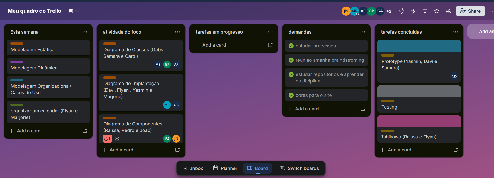

# Ata de Reunião 04 - Projeto de Software

| Item | Detalhe |
| --- | --- |
| **Data** | 13 de abril de 2026 |
| **Duração** | Aproximadamente 60 minutos |
| **Participantes** | Gabriel Santos, Maria Samara, Marjorie Mitzi, Yasmin Dayrell, Davi Negreiros, João Marcelo, Pedro Henrique, Raissa Silva de Oliveira e Guilherme Flyan |

## 1. Objetivo

A reunião teve como objetivo organizar a execução da Entrega 2 do projeto, definindo a estrutura de trabalho, a divisão de tarefas entre os membros e o processo de acompanhamento das atividades.

<strong>Figura 1 - Trello</strong> Fonte: respectiva reunião comentada na ATA IV (2026).

## 2. Discussões

### 2.1 Definição dos focos do projeto

Foram estabelecidos três focos principais para a Entrega 2:

- **Foco 1:** modelagem estática.
- **Foco 2:** modelagem dinâmica.
- **Foco 3:** modelagem organizacional e casos de uso.

Também foi discutido que cada foco reunirá diagramas específicos em UML, de acordo com o escopo definido para a próxima entrega.

### 2.2 Divisão das equipes

O grupo foi organizado em trios, quartetos e grupos de cinco integrantes para desenvolver os diagramas.

- O diagrama de classes foi tratado como o mais complexo, recebendo mais integrantes.
- A tendência foi manter os mesmos grupos entre os focos 1 e 2, a fim de facilitar a comunicação e reduzir retrabalho.

### 2.3 Pontos de melhoria indicados pela professora

Foram registrados alguns feedbacks importantes para a evolução do material:

- Evitar generalizações, identificando quem fez cada parte do trabalho.
- Incluir tabela de participação.
- Nomear autores nos diagramas.
- Acrescentar mais referências teóricas nos textos.
- Explicar melhor o raciocínio e as decisões tomadas pelo grupo.

### 2.4 Organização do projeto

Foi definido que será criado um repositório novo para a entrega.

- A estrutura deverá conter pastas por foco.
- Os diagramas e imagens serão organizados em seus respectivos diretórios.
- As atas da reunião também farão parte da documentação.

O grupo reforçou o uso do Trello para controle de tarefas, registro de responsáveis e prevenção de retrabalho.

### 2.5 Processo de trabalho e Scrum

Foi discutida a adoção de um processo de acompanhamento baseado em Scrum.

- Será definido um responsável para organizar planning, dailies, review e retrospectiva.
- As dailies deverão ser rápidas, com duração estimada entre 5 e 10 minutos, e registradas por gravação.
- Também será criado um calendário do projeto para apoiar o cumprimento dos prazos.

### 2.6 Boas práticas e uso de referências

O grupo definiu algumas boas práticas para a continuidade do trabalho:

- Fazer commits frequentes, evitando concentração das entregas no último dia.
- Trabalhar com branches e pull requests, com revisores definidos.
- Manter comunicação entre os grupos para garantir consistência entre os diagramas.
- Revisar o trabalho dos colegas antes da consolidação final.

Também foi proposta a criação de um repositório de referências confiáveis e o uso de ferramentas como NotebookLM para centralizar materiais e reduzir o risco de referências falsas geradas por IA.

## 3. Encaminhamentos

- Estruturar o novo repositório da Entrega 2.
- Distribuir formalmente os integrantes por foco.
- Elaborar a tabela de participação e registrar os autores dos diagramas.
- Organizar o calendário do projeto e as dailies.
- Consolidar o uso do Trello como registro das tarefas e evidências.
- Reunir fontes teóricas confiáveis para apoiar os textos e diagramas.

## 4. Conclusão

A reunião definiu a base organizacional da Entrega 2, alinhando focos, responsabilidades e processo de trabalho. Além disso, foram registrados os principais feedbacks da professora e os encaminhamentos para documentação, rastreabilidade e controle das atividades do grupo.

## Histórico de Versões 📅

| Versão | Data | Descrição | Autor(es) | Revisor(es) |
| :--: | :--: | :--: | :--: | :--: |
| 1.0 | 22/04/2026 | Adição da Ata de Reunião 04 e do histórico de versões. | João Marcelo Guimarães Costa Naves | Davi Negreiros |