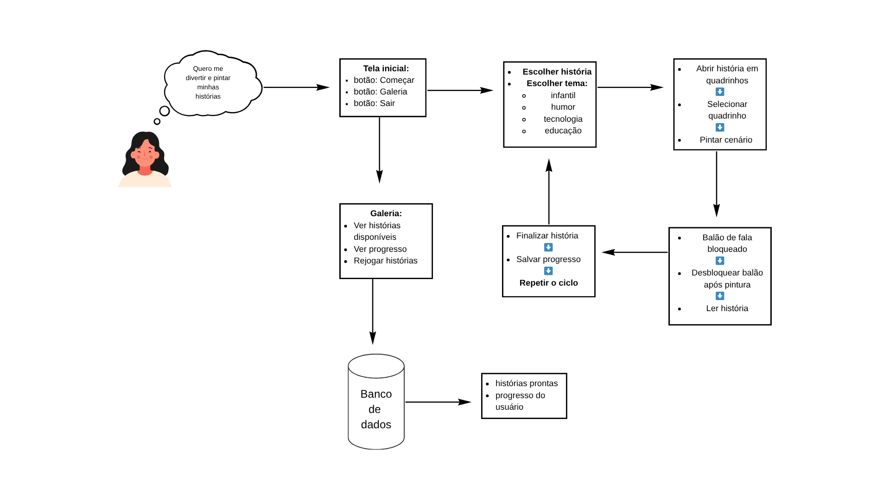
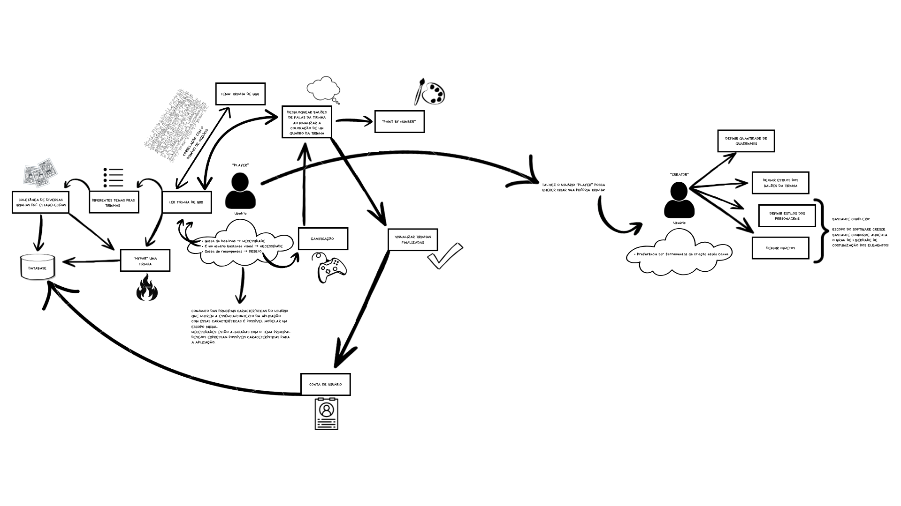
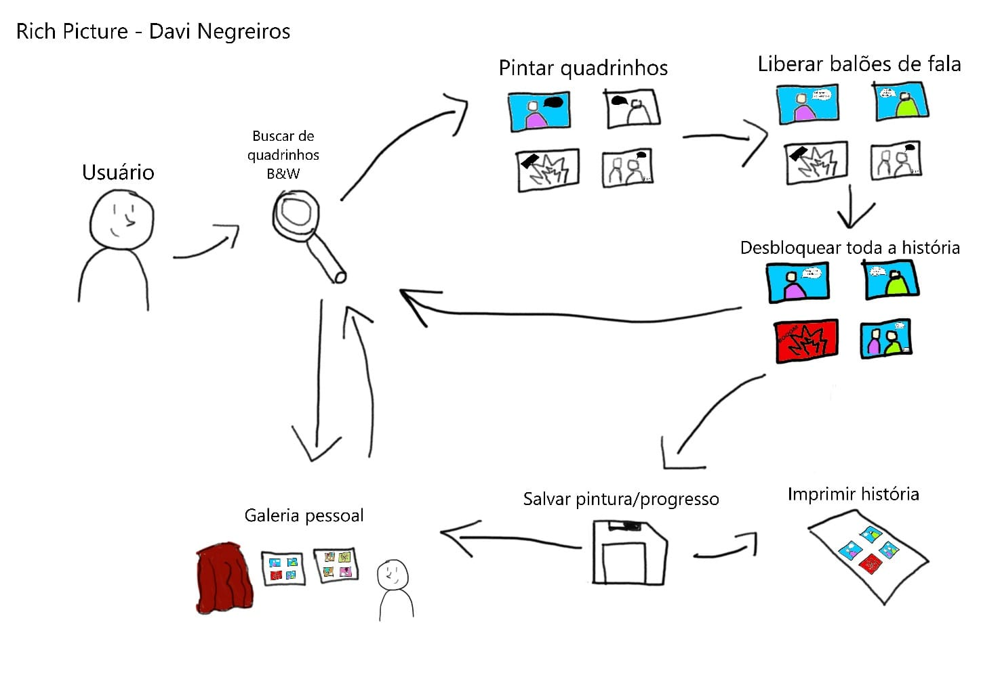
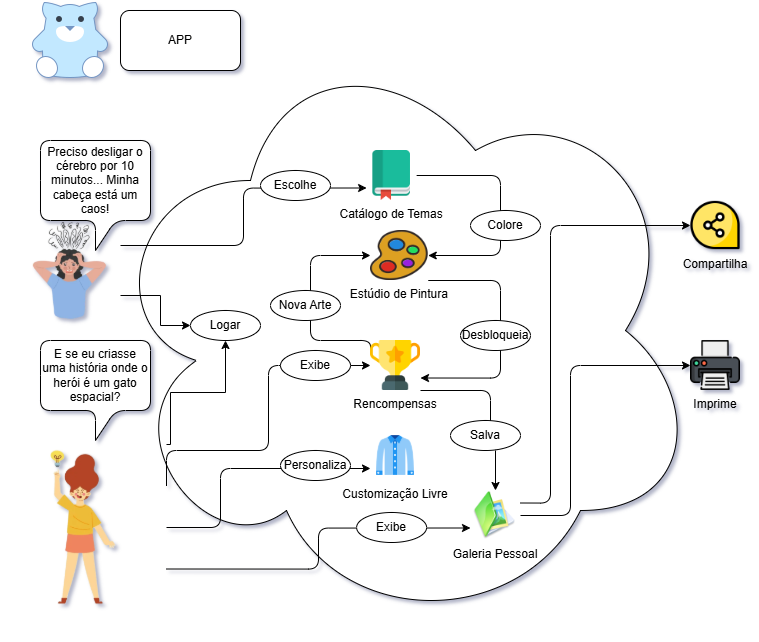
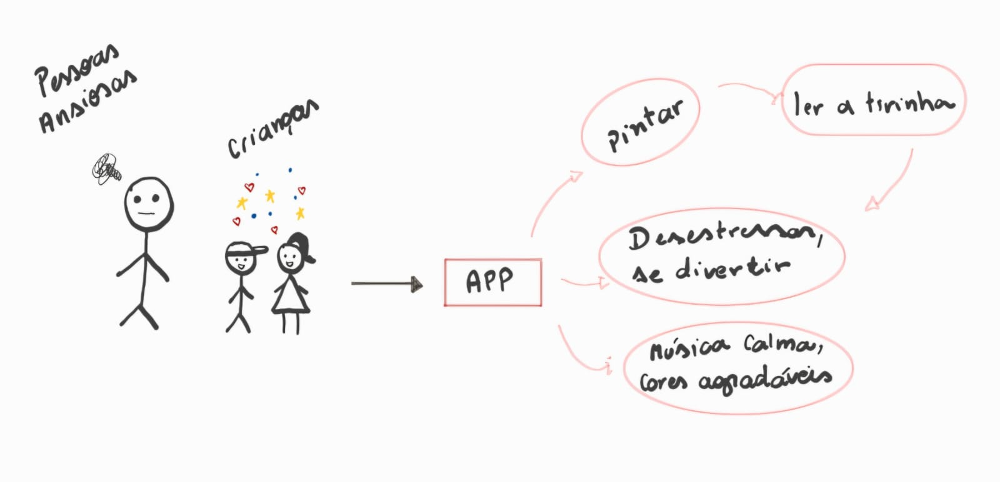
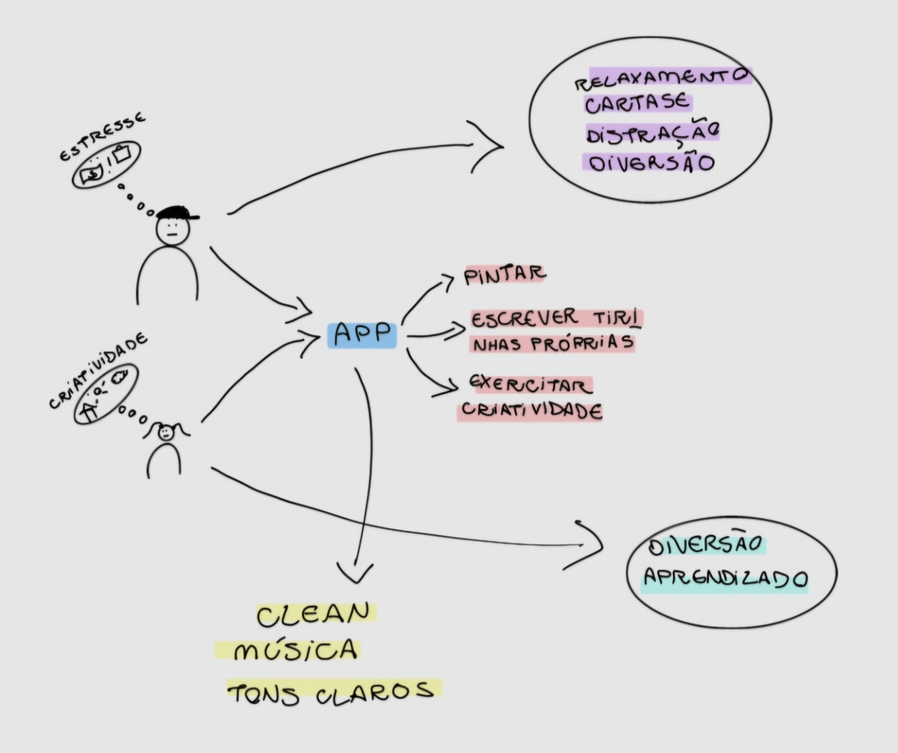
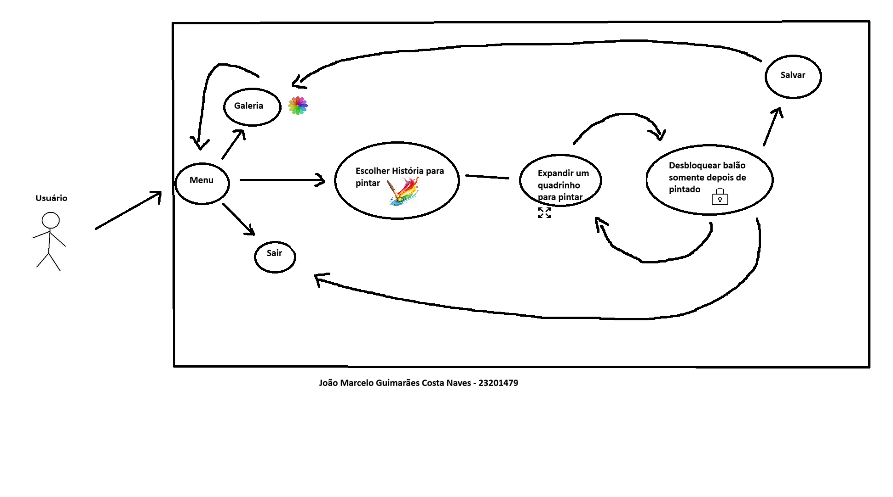
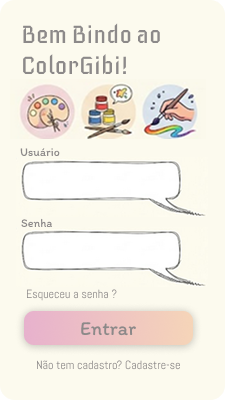
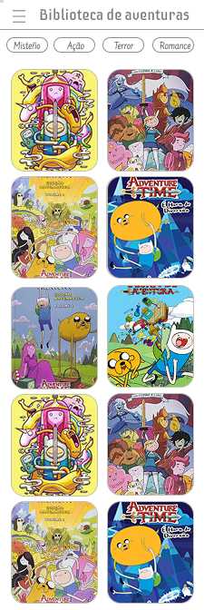
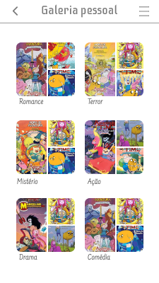

# 1.1. Módulo Design Sprint

## Introdução

O *Design Sprint* é uma metodologia ágil de cinco dias criada pelo Google Ventures para acelerar o processo de validação de ideias e solução de problemas complexos através de prototipagem e testes com usuários reais. Esta abordagem permite que equipes multidisciplinares colaborem de forma estruturada para desenvolver, prototipar e testar soluções inovadoras em um curto período de tempo.

No contexto do **MinhaTirinha**, o Design Sprint foi essencial para definir a proposta de valor do aplicativo: uma ferramenta de entretenimento focada no alívio do estresse através da pintura de histórias em quadrinhos. Apesar de o modelo tradicional de Design Sprint possuir curta duração, no contexto do projeto ele foi estendido para três semanas devido à necessidade de maior aprofundamento na validação com stakeholders e definição do escopo inicial.

## Metodologia

A metodologia do Design Sprint foi aplicada pelo nosso grupo seguindo as cinco etapas fundamentais: **Unpack** (Mapear), **Sketch** (Esboçar), **Decision** (Decidir), **Prototype** (Prototipar) e **Test** (Testar).

## Gestão do Projeto

Para a organização das atividades e acompanhamento do fluxo de trabalho durante o Design Sprint e o desenvolvimento da Base, o grupo utilizou o **Trello**.A ferramenta permitiu a divisão de tarefas em colunas de *Backlog*, *Doing* e *Done*, garantindo a transparência e o cumprimento dos prazos.

>**[Acesse aqui o Quadro Kanban do Grupo 08 no Trello](https://trello.com/b/VwjTEPPO/meu-quadro-do-trello)**

## Unpack (Mapear)

### Brainstorming

Foi utilizada a técnica de brainstorm para a geração de ideias e levantamento de requisitos iniciais, chegando ao conceito central do **MinhaTirinha**.

  
  
Figura 1: Brainstorming do Grupo (Fonte: Grupo 08, 2026)

## Sketch (Esboçar)

### Rich Pictures Individuais 

Nesta etapa, cada membro da equipe desenvolveu uma visão particular sobre o funcionamento do sistema e a jornada do usuário. O uso de Rich Pictures individuais permitiu explorar diferentes fluxos e necessidades antes da consolidação final.

Rich Pictures Individuais:
    * **Ana Carolina:** 
    * **Guilherme Flyan:** 
    * **Davi Negreiros:** 
    * **Pedro Henrique:** 
    * **Raíssa Oliveira:** 
    * **Marjorie Mitzi:** 
    * **Gabriel Pinto:** 
    * **Yasmin:** 
    * **Maria Samara:** .jpg)
    * **João Marcelo:** 

## Decision (Decidir)

Após a análise das propostas individuais, o grupo realizou uma síntese para criar o **Rich Picture Unificado**. Este artefato final remove redundâncias e foca na trajetória crítica do usuário: a transição do estado de estresse para o relaxamento através da interação com o sistema.

**O que foi feito:** Unificamos o fluxo de "pintura para desbloqueio de texto", a integração com o banco de dados de histórias e as opções de compartilhamento social que apareceram como pontos fortes em todos os desenhos individuais.

# Rich Picture Unificado

A seguir, a Figura 2 mostra o Rich Picture final, que foi elaborado a partir da consolidação das ideias individuais de cada membro do grupo. Este artefato sintetiza a trajetória completa do usuário e as principais funcionalidades do sistema **MinhaTirinha**.

  
  
Figura 2: Rich Picture Unificado (Fonte: Grupo 08, 2026)

### Diagrama de Ishikawa

O diagrama abaixo, gerado como parte do refinamento visual, detalha as causas específicas identificadas, como a cultura da imediatividade e a preferência por conteúdos dopaminérgicos, vale ressaltar que os 6M’s foram adaptados ao contexto da aplicação com auxílio de IA entretanto as causas foram identificadas manualmente, onde cada M diz respeito a:

  * Método (lógicas, hábitos diários e fluxos de consumo): Refere-se à forma como as pessoas organizam seu tempo e aos rituais (ou falta deles) para consumir entretenimento;
  * Material (informações, conteúdos e estímulos digitais): Refere-se à matéria-prima informacional e ao tipo de conteúdo que disputa a atenção do usuário hoje;
  * Mão de Obra (capacidade cognitiva, atores e usuários): Refere-se às condições psicológicas e biológicas do usuário final e das pessoas ao seu redor;
  * Máquina (dispositivos, plataformas e interfaces): Refere-se aos aparelhos e ambientes digitais que moldam o comportamento do usuário;
  * Medida (métricas, percepção de progresso e feedbacks): Refere-se a como o usuário percebe se está evoluindo, relaxando ou "ganhando" algo com a atividade;
  * Meio Ambiente (contexto social, cultura e ecossistema): Refere-se ao cenário externo, cultural e do dia a dia que molda o estilo de vida da população;

  
  
Figura 3: Diagrama de Ishikawa (Fonte: Grupo 08, 2026)

### Storyboard

O storyboard detalha visualmente o cenário de uso principal do aplicativo, validando a jornada definida no Rich Picture.

  
  
Figura 4: Storyboard da jornada do usuário (Fonte: Grupo 08, 2026)

#### Descrição Detalhada da Jornada

* **Quadrinho 1 — O problema:** O personagem aparece cansado e estressado, apresentando o conflito inicial: a necessidade de aliviar a mente após um momento de tensão.
* **Quadrinho 2 — A descoberta:** O personagem encontra o aplicativo, mudando sua expressão para curiosidade e esperança ao enxergar uma possibilidade de distração criativa.
* **Quadrinho 3 — O início da interação:** O usuário realiza o login, representando a porta de entrada oficial para a experiência de uso.
* **Quadrinho 4 — A escolha do tema:** O personagem escolhe um tema para sua tirinha, evidenciando a simplicidade e a intuitividade da interface.
* **Quadrinho 5 — Criação e pintura:** O ponto central da narrativa, onde a concentração na pintura substitui o estresse por leveza e exercício da criatividade.
* **Quadrinho 6 — O resultado final:** O personagem aparece relaxado e satisfeito, concretizando o objetivo do app: proporcionar bem-estar e diversão.

---

## Estimativas

Este documento apresenta as **estimativas de esforço, tempo e custo** para o desenvolvimento do projeto, utilizando a técnica de **Avaliação de Especialista**.  

Essa técnica consiste em reunir membros com conhecimento no domínio do projeto, que discutem e atribuem valores de esforço para cada atividade. A estimativa final é obtida por meio da **média das avaliações**, garantindo maior confiabilidade.

### Informações do Projeto

- **Nome do projeto:** MinhaTirinha  
- **Grupo:** 06  
- **Professora:** Milene Serrano  
- **Plataforma alvo:** Mobile 

---

### Premissas e Restrições

| ID | Premissa/Restrição | Impacto | Observação |
|:-:|------------------|--------|------------|
| P1 | Desenvolvimento em Python | Médio | Linguagem principal definida |
| R1 | Tempo de entrega acadêmico | Alto | Prazos definidos pela disciplina |
| R2 | Funcionalidades priorizadas | Médio | Foco na criação de tirinhas |
| R3 | Equipe reduzida | Médio | Poucos desenvolvedores |
| R4 | Uso de ferramentas simples | Baixo | Sem frameworks complexos |

---

### Método de Estimativa

- **Técnica:** Avaliação
- **Participantes:** João Marcelo, Davi Monteiro
- **Critério de consenso:** Média aritmética  

---

### Lista de Atividades e Estimativas

| ID | Requisito | Complexidade | Esforço | Custo | Observações |
|:-:|------------|--------------|---------|-------|-------------|
| RF1 | Realizar cadastro | Médio | Médio | Médio | Cadastro básico |
| RF2 | Realizar login | Médio | Médio | Médio | Autenticação |
| RF3 | Visualizar catálogo | Baixo | Médio | Médio | Listagem |
| RF4 | Selecionar história | Baixo | Baixo | Baixo | Navegação |
| RF5 | Visualizar histórias iniciadas | Médio | Médio | Baixo | Histórico |
| RF6 | Acessar galeria pessoal | Baixo | Médio | Médio | Arquivos |
| RF7 | Exibir história em sequência | Baixo | Baixo | Baixo | Renderização |
| RF8 | Selecionar quadrinho | Baixo | Baixo | Baixo | Interação |
| RF9 | Inserir elementos | Médio | Médio | Médio | Edição |
| RF10 | Pintar elementos | Médio | Médio | Médio | Ferramenta |
| RF11 | Bloquear balões | Médio | Baixo | Baixo | Controle |
| RF12 | Desbloquear balões | Médio | Médio | Médio | Reversão |
| RF13 | Feedback de conclusão | Baixo | Baixo | Baixo | UX |
| RF14 | Paleta de cores | Médio | Médio | Médio | Interface |
| RF15 | Ferramenta balde | Alto | Alto | Alto | Preenchimento |
| RF16 | Borracha | Médio | Médio | Médio | Edição |
| RF17 | Cores recentes | Médio | Médio | Médio | UX |
| RF18 | Cor via RGB | Médio | Baixo | Baixo | Configuração |
| RF19 | Salvar automático | Alto | Alto | Alto | Persistência |
| RF20 | Salvar remoto | Alto | Alto | Alto | Banco de dados |
| RF21 | Retomar progresso | Médio | Baixo | Baixo | Continuidade |
| RF22 | Redefinir progresso | Médio | Médio | Baixo | Reset |
| RF23 | Compartilhar/baixar | Médio | Baixo | Baixo | Exportação |

---

### Critérios de Classificação

**Complexidade**
- Baixo: Simples  
- Médio: Moderado  
- Alto: Complexo  

**Esforço**
- Baixo: Rápido  
- Médio: Moderado  
- Alto: Demorado  

**Custo**
- Baixo: Poucos recursos  
- Médio: Recursos moderados  
- Alto: Alto custo  

---

## Protótipos

## Introdução

Protótipos de Alta Fidelidade
Os protótipos de alta fidelidade foram desenvolvidos para validar a interface e a experiência do usuário (UX), focando em uma estética relaxante com tons pastéis e interações intuitivas.

1. Navegação e Exploração
A jornada começa na Biblioteca de Aventuras, onde o usuário pode filtrar histórias por gênero e acessar o menu lateral para gerenciar sua conta e galeria.

2. Experiência de Pintura e Progresso
O diferencial do aplicativo é a mecânica de "Pintar para Ler". O usuário só desbloqueia os diálogos e avança na história à medida que completa a pintura do quadrinho, incentivando o foco e a atenção plena.

3. Galeria Pessoal e Compartilhamento
Após concluir uma obra, o usuário pode visualizar sua coleção organizada por gêneros na Galeria Pessoal e compartilhar seu progresso em redes sociais, reforçando o aspecto positivo da conquista.

## Protótipo de Alta Fidelidade

# **Cadastro**

# **Login**

# **Side bar**

# **Biblioteca**

# **História completa**

# **Tela de pintar**
.png)

# **Tela de progresso**

# **Galeria**

# **Salvar e compartilhar**
.png)

## Validação
A validação de software é o processo de verificar se o sistema atende às necessidades reais do usuário e se cumpre seu propósito de uso. No caso da equipe, a metodologia utilizada foi uma validação formativa de protótipo com usuário, feita por meio de uma reunião guiada, em que os integrantes apresentaram as 9 telas do aplicativo e fizeram perguntas sobre clareza, cores, legibilidade, organização dos elementos e entendimento do fluxo. Assim, a avaliação teve foco mais qualitativo do que técnico, buscando identificar se o protótipo era compreensível e intuitivo para o usuário.

Pela descrição da reunião, os resultados foram positivos. O usuário considerou o protótipo intuitivo, elogiou a identidade visual, a legibilidade das fontes e a organização das telas. Também entendeu bem o fluxo entre cadastro, login, biblioteca, pintura, desbloqueio de falas, progresso, compartilhamento e galeria pessoal. Isso mostra que o protótipo conseguiu comunicar bem suas funções principais e oferecer uma navegação coerente.

Como pontos de melhoria, surgiram principalmente duas sugestões: adicionar a funcionalidade de “esqueci minha senha” nas telas de autenticação e incluir títulos nos gibis da biblioteca para facilitar a identificação do conteúdo. Esses achados são relevantes porque mostram ajustes simples, mas importantes, para melhorar a experiência do usuário e a completude funcional da solução.

- ### Documento de transcrição da validação:

[Transcrição da validação](../assets/Design_Sprint/ReuniãoEmValidação.pdf)

- ### Reletório de validação do protótipo

1. **Objetivo**

Este documento tem como objetivo apresentar os resultados da validação de um protótipo de aplicativo de colorir, com foco na análise de usabilidade, compreensão da interface e eficiência do fluxo de navegação.

A validação buscou verificar se o usuário é capaz de:
- Navegar entre as telas de forma intuitiva
- Compreender o funcionamento geral do sistema
- Executar tarefas sem auxílio
- Identificar possíveis dificuldades ou pontos de melhoria

2. **Público-Alvo**

A validação foi realizada com o usuário que:
- Possuem familiaridade básica com aplicativos móveis
- Demonstram interesse em jogos ou atividades interativas

3. **Cenário de Uso**

“Imagine que você baixou um aplicativo de colorir para relaxar e acompanhar seu progresso. Você deseja escolher um desenho, começar a pintar e depois visualizar sua evolução dentro do aplicativo.”

4. **Metodologia**

O teste foi conduzido de forma moderada com acompanhamento.

Durante a execução:
- O participante foi incentivado a pensar em voz alta
- Não houve interferência do facilitador durante as tarefas

5. **Resultados por Tarefa**

5.1 Cadastro/Login
Resultados:
- Interface considerada visualmente agradável
- Cores bem avaliadas
- Tipografia legível
- Estrutura adequada

Pontos de melhoria:
- Ausência da funcionalidade “Esqueceu a senha?”
- Falta de orientações sobre requisitos de senha

5.2 Explorar a Biblioteca
Resultados:
- Variedade de desenhos bem avaliada
- Sistema de abas intuitivo
- Filtros funcionais

Pontos de melhoria:
- Falta de títulos nos desenhos
- Melhor integração entre “Continuar colorindo” e “Progresso”
- Falta de tela específica para galeria pessoal com filtros

5.3 Iniciar Pintura
- Fluxo claro e direto

5.4 Continuar Pintura
- Funcionalidade compreendida com facilidade

5.5 Visualizar Progresso
- Indicadores claros

5.6 Compartilhar Desenho
- Ícones e botões compreensíveis

5.7 Acessar Galeria Pessoal
- Organização clara

6. **Feedback do Usuário**

Pontos positivos:
- Interface intuitiva
- Navegação clara
- Design agradável
- Cores atrativas 

Pontos de melhoria:
- Inclusão da funcionalidade “Esqueceu a senha?”
- Adição de títulos nos desenhos
- Melhor integração entre telas

7. **Conclusão**

A validação demonstrou boa usabilidade e compreensão do sistema, com oportunidades de melhoria relacionadas à recuperação de senha, organização de conteúdo e integração entre funcionalidades.

## Referência Bibliográfica

1. **SERRANO, Milene**. *Arquitetura e Desenho de Software - Aula BPMN*. UnB, 2026.
2. **SERRANO, Milene**. *Arquitetura e Desenho de Software - Aula Revisão Requisitos*. UnB, 2026.
3. **SERRANO, Milene.** *Arquitetura e Desenho de Software - Aula RichPicture*. Material de aula (slides). Universidade de Brasília (UnB), 2026.

## Histórico de Versões 

| Versão | Data | Descrição | Autor(es) | Revisor(es) |
| :----: | :--------: | :----------------------------------------------: | :----------: | :---------: |
| 1.0 | 30/03/2026 | Elaboração inicial dos artefatos | Grupo 08 | — |
| 1.1 | 04/04/2026 | Unificação do Rich Picture e padronização visual | Marjorie Mitzi | João Marcelo |
| 1.2 | 05/04/2026 | Adição das estimativas do projeto | João Marcelo | — |
| 1.3 | 05/04/2026 | Refatoração da explicação do Digrama de Ishikawa | Guilherme Flyan | Maria Samara |
| 1.4 | 31/03/2026 | Adição do Storyboard | Gabriel Santos e Pedro Henrique | Maria Samara |
| 1.5 | 04/04/2026 | Unificação do Rich Picture e padronização visual | Marjorie Mitzi | João Marcelo |
| 1.6 | 05/04/2026 | Adição das estimativas do projeto | João Marcelo | — |
| 1.7 | 06/04/2026 | Adição da validação do protótipo | Gabriel Santos, Maria Samara e Marjorie Mitzi| Ana Carolina Fialho |
| 1.8 | 06/04/2026 | Formatando imagens do Rich Picture | Gabriel Santos | Guilherme Flyan |
| 1.9 | 06/04/2026 | Adição do relatório de validação | Maria Samara | Gabriel Santos |
