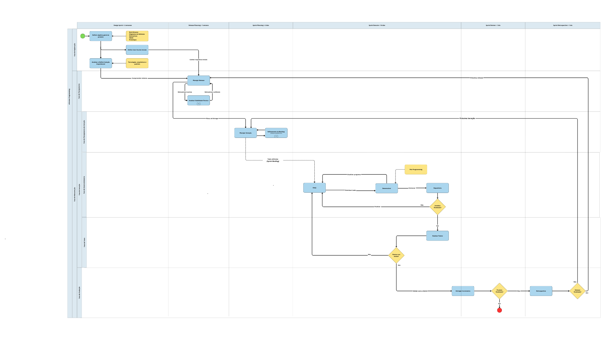

# 1.3. Módulo Modelagem BPMN

## Introdução
A modelagem BPMN (*Business Process Model and Notation*) é uma notação padrão para representar os processos de trabalho de forma visual e compreensível, facilitando o alinhamento entre a equipe e os stakeholders. Para o desenvolvimento do **MinhaTirinha**, o Grupo 08 adotou uma abordagem baseada em metodologias ágeis, focando na rastreabilidade e qualidade técnica.

## Metodologia

O grupo optou por uma metodologia dirigida por uma **abordagem ágil** principalmente pelo fato de possuirmos 10 integrantes em nosso grupo tornando nossa equipe relativamente grande onde todos os integrantes além de desenvolvedores são também stakeholders, fazendo com que sempre exista a possibilidade de definirmos novos requisitos para o projeto devido a grande quantidade de opiniões diferentes e insights que temos, portanto concluímos assim que nossos requisitos não são estáveis o suficiente e nem possuem um nível alto de criticidade para que adotemos por uma abordagem dirigida por plano ou híbrida.

Devido as características citadas acima e a aderência à uma abordagem ágil, optamos por um **ciclo de vida ágil**, caracterizado por iterações curtas e incrementos contínuos do produto para que possamos praticar os princípios dos valores ágeis ressaltando principalmente a fundamentalidade da colaboração devido a grande quantidade de stakeholders envolvidos no projeto a fim de que possamos desenvolver um produto de qualidade.

Então com base na abordagem e ciclo de vida adotados consensualizamos a escolha de um processo de desenvolvimento de software que se alinhe ao nosso contexto definindo o **eXtreme Programming - XP** como processo para guiar o nosso desenvolvimento através de seus passos, práticas, técnicas e atividades, ressaltando que o XP é particularmente adequado para:

  * Projetos com requisitos voláteis ou mal compreendidos inicialmente.
  * Ambientes onde o feedback rápido e a adaptabilidade são prioritários.
  * Sistemas que podem evoluir incrementalmente com valor entregue desde cedo.

Para melhor gestão adotamos também o framework **Scrum** e o método **Kanban** que fornecem estruturas para que possamos organizar e coordenar o desenvolvimento do produto de software.

* **eXtreme Programming:** O eXtreme Programming (XP) é uma metodologia ágil que leva práticas de engenharia de software reconhecidas a níveis "extremos", integrando-as em um processo coeso com foco em comunicação, simplicidade, feedback e coragem. (BECK; ANDRES, 2004).
* **Scrum:** Scrum é um framework leve que ajuda pessoas, times e organizações a gerar valor por meio de soluções adaptativas para problemas complexos. (SCHWABER; SUTHERLAND, 2020).
* **Kanban:** Com o Método Kanban, você visualiza o trabalho do conhecimento que está invisível e como ele se move através de um fluxo de trabalho.(KANBAN UNIVERSITY, 2010).

## Desenvolvimento: Modelagem do Processo

O diagrama abaixo representa a integração entre o processo utilizado para desenvolvimento do produto **XP - eXtremme Programming** e o framework de gestão e organização de trabalho **Scrum** ressaltando como guia o uso das seguintes literaturas para o desenvolvimento da modelagem:

* **Agile Modeling: Effective Practices for eXtreme Programming and the Unified Process** por **Scott Ambler**, **2002**.
* **Essential Scrum: A Practical Guide to the Most Popular Agile Process** por **Kenneth S. Rubin**, **2012**.

Figura 1: Modelagem BPMN eXtreme Programming + Scrum (Fonte: Grupo 08, 2026)

Para visualização mais clara acesse o link: [Modelagem BPMN eXtremme Programming + Scrum](https://canva.link/f21v6pywfqpv3bq)

O seguinte diagrama representa o fluxo de trabalho do nosso quadro de gestão visual implementado pelo **Quadro Kanban** que é utilizado em paralelo ao processo ScrumXP ressaltando como guia o uso da seguinte literatura para o desenvolvimento da modelagem:

Figura 2: Modelagem BPMN do Fluxo de Trabalho do Quadro Kanban (Fonte: Grupo 08, 2026)

### Explicação do Fluxo Gerado

A modelagem BPMN foi estruturada utilizando fluxos de sequência para representar a execução das atividades dentro de um mesmo processo, mesmo quando distribuídas em diferentes raias. Fluxos de mensagem foram utilizados apenas quando necessário para representar comunicação com entidades externas ao processo, garantindo aderência às boas práticas da notação BPMN.

O processo foi modelado em diversas raias separando as atividades e passos a serem realizados e também foi datado em milestones referentes aos ciclos do Scrum para organizar cronologicamente o fluxo de trabalho:

1.  **eXtreme Programming:**
    * Segundo a literatura, por mais que o processo XP seja altamente iterativo, ele pode ser abstraído para algumas fases que interagem entre si orquestrando um fluxo para a construção de um produto de software. Baseando-se nos materiais disponíveis na literatura, podemos abstrair o processo em 2 etapas abrangentes:
    1. **Fase de Exploração:** Esta é uma fase única e também é a primeira fase que um projeto XP "vive", sendo nela consensualizada um objetivo geral para o produto, definindo assim as primeiras histórias de usuário a serem exploradas e soluções/decisões arquiteturais pertinentes ao projeto.
    2. **Fase de Manutenção:** É nessa fase em que a grande quantidade de projetos XP atuais se encontram, representando uma fase em que já se tem um produto mas ainda tem novas funcionalidades a serem implementadas. Essa fase compreende o coração do XP sendo formada por:
        1. **Fase de Planejamento:** Corresponde a fase de definição através de análises e estimativas do conjunto de User Stories a serem implementadas durante uma release pela equipe.
        2. **Fase de Iteração:** É tida como a fase central do XP pois é nela em que o desenvolvimento do produto é realizado. É uma fase que pode ser subdividida em várias subfases que estão o tempo todo interagindo entre si, sendo que para nosso contexto a melhor subdivisão foi a seguinte:
            1. **Fase de Planejamento da Iteração:** É nessa fase onde serão definidas as tarefas (tasks) relacionadas a um subconjunto de User Stories a cada iteração.
            2. **Fase de Desenvolvimento:** Essa é a fase explicita de desenvolvimento do produto onde a ideia é produzir os artefatos pertinentes as tarefas estabelecidas pelas User Stories a fim de gerar um novo incremento do produto.
            3. **Fase de Teste:** Ao fim do desenvolvimento de um artefato ele deve ser testado para verificar sua qualidade.
        3. **Fase de Produção:** É a fase de entrega de um incremento do produto, evidenciando a comunicação constante com os stakeholders através da validação quanto a qualidade da entrega e se ela atende as suas necessidades, sendo também o marco da definição de que devemos continuar o desenvolvimento do produto ou não.

2.  **Scrum:**
    * O Scrum é um framework ágil de organização de trabalho que contêm vários eventos dentro de um único evento cíclico chamado **Sprint**. Uma única Sprint armazena uma série de eventos sequencias cronológicos a fim de que a equipe produza artefatos que auxiliem e guiam o desenvolvimento do produto:
      1. **Sprint Planning**: A equipe define uma meta e refina o Product Backlog para extrair um subconjunto de itens que servem de insumos ao Sprint Backlog representando o que deve ser executado naquela Sprint.
      2. **Sprint Execute**: Representa a série de atividades realizadas diariamente para a conclusão do trabalho definido no Sprint Backlog a fim de atingir a meta estipulada e gerar um incremento do produto.
      3. **Sprint Review**: Serve para inspecionar o resultado da Sprint através de validações com os principais stakeholders.
      4. **Sprint Retrospective**: A equipe avalia a qualidade do trabalho realizado a fim de identificar oportunidades (como o que deu certo, o que deu problema, como corrigiram problemas) para melhorar a eficácia da aplicação do Scrum no contexto do projeto.

Além de utilizar o Scrum como milestone cronológica para organizar o desenvolvimento de nosso produto utilizamos como primeira milestone (sendo uma etapa única não fazendo parte de ciclos iterativos) o **Design Sprint** para validarmos as ideias dos stakeholders e definir o objetivo geral do produto, e também ao início de cada release que é precedida por um ciclo de Sprints, uma etapa de **Release Planning** para definir o conjunto de ideias e User Stories a serem trabalhados durante a release.

3. **Kanban**: 
    * Quanto ao uso do método Kanban em nosso projeto, que se trata de uma forma de organização e gestão visual de tarefas (tasks), será utilizado em paralelo ao processo ScrumXP através da ferramenta Trello desempenhando um papel de artefato chamado Quadro Kanban.

      1. **Quadro Kanban**: Os quadros Kanban são o meio mais comum de visualizar um sistema Kanban. Puxar o trabalho da esquerda para a direita é comum em todos os quadros: novos itens de trabalho entram no quadro pela esquerda. Quando os itens de trabalho saem pela direita, o valor é entregue aos clientes.(KANBAN UNIVERSITY, 2010). Sendo que em nosso projeto o fluxo de trabalho é divido da seguinte forma: **definição da tarefa**, **desenvolvimento**, **teste** e **tarefa finalizada**.

## Referência Bibliográfica

1. **SERRANO, Milene**. *Arquitetura e Desenho de Software - Aula BPMN*. UnB, 2026.
2. **PROJECT MANAGEMENT INSTITUTE**. *A Guide to the Project Management Body of Knowledge (PMBOK Guide)*. 7th Edition, 2021.
3. **KANBAN UNIVERSITY**. *O Guia Oficial do Método Kanban*. Seattle: Mauvius Group Inc., 2021.
4. **BECK, Kent; ANDRES, Cynthia**. Extreme Programming Explained: Embrace Change. 2. ed. Boston: Addison-Wesley, 2004.
5. **SCHWABER, Ken; SUTHERLAND, Jeff***. *O Guia do Scrum: As Regras do Jogo*. [S.l.]: Scrum.org, 2020.
6. **AMBLER, Scott.** *Agile Modeling: Effective Practices for eXtreme Programming and the Unified Process*. New York: John Wiley & Sons, Inc., 2002.
7. **RUBIN, Kenneth S**. *Essential Scrum: A Practical Guide to the Most Popular Agile Process*. Upper Saddle River: Addison-Wesley, 2012.

## Histórico de Versões 

| Versão | Data | Descrição | Autor(es) | Revisor(es) |
| :--: | :--: | :--: | :--: | :--: |
| 1.0 | 30/03/2026 | Criação do documento (Template) | Grupo 08 | — |
| 1.1 | 04/04/2026 | Inserção do diagrama PNG e detalhamento das etapas | Marjorie Mitzi | Guilherme Flyan |
| 1.2 | 05/04/2026 | Refatoração do documento e do detalhamento das etapas | Guilherme Flyan | Marjorie Mitzi |
| 1.3 | 06/04/2026 | Revisão e refatoração do documento | Yasmin Dayrell| Marjorie Mitzi, Guilherme Flyan |
| 1.4 | 06/04/2026 | Correções na modelagem BPMN (fluxos), ajuste da duração do Design Sprint e revisão da documentação | Ana Carolina Fialho | Raissa Silva |
| 1.5 | 06/04/2026 | Revisão do documento | Gabriel Pinto | Pedro Henrique, Maria Samara |

Fonte: Grupo 08, 2026.
