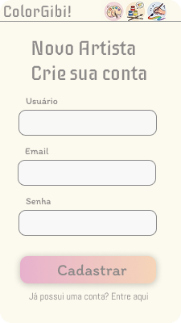

# Protótipo

## Introdução

Protótipos de Alta Fidelidade
Os protótipos de alta fidelidade foram desenvolvidos para validar a interface e a experiência do usuário (UX), focando em uma estética relaxante com tons pastéis e interações intuitivas.

1. Navegação e Exploração
A jornada começa na Biblioteca de Aventuras, onde o usuário pode filtrar histórias por gênero e acessar o menu lateral para gerenciar sua conta e galeria.

2. Experiência de Pintura e Progresso
O diferencial do aplicativo é a mecânica de "Pintar para Ler". O usuário só desbloqueia os diálogos e avança na história à medida que completa a pintura do quadrinho, incentivando o foco e a atenção plena.

3. Galeria Pessoal e Compartilhamento
Após concluir uma obra, o usuário pode visualizar sua coleção organizada por gêneros na Galeria Pessoal e compartilhar seu progresso em redes sociais, reforçando o aspecto positivo da conquista.

## Protótipo de Alta Fidelidade

# **Cadastro**

## Referências Bibliográficas

> 🚧 Referências a serem adicionadas.

## Histórico de Versões 📅

| Versão | Data | Descrição | Autor(es) | Revisor(es) |
| :--: | :--: | :--: | :--: | :--: |
| 1.0 | 30/03/2026 | Criação do documento (Template) | Grupo 08 | — |
| 1.1 | 06/04/2026 | Adição dos protótipos | Maria Samara | Marjorie Mitzi |