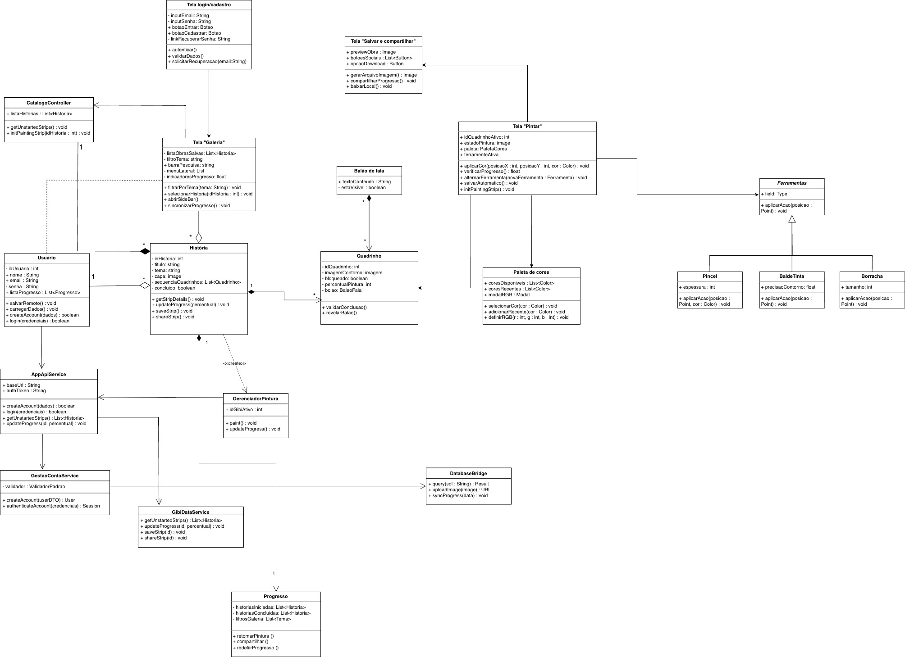
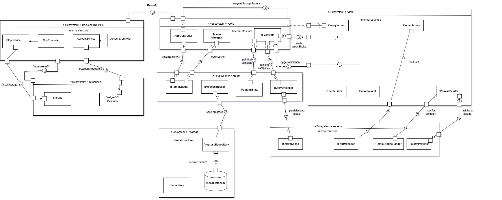
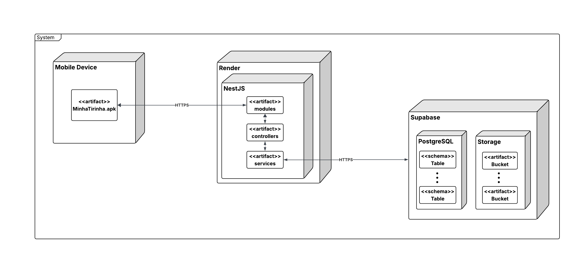

# 2.1. Módulo Modelagem Estática UML

## Participantes

Tabela 1: Participantes

<table>
  <thead>
    <tr>
      <th>Nome</th>
      <th>Função</th>
      <th>Data</th>
      <th>Hora</th>
    </tr>
  </thead>
  <tbody>
    <tr>
      <td><a href="https://github.com/SamaraAlvess">Samara Alves</a></td>
      <td>Diagrama de Classe</td>
      <td>21/04/2026</td>
      <td>15:30</td>
    </tr>
    <tr>
      <td><a href="https://github.com/anawcarol">Ana Carolina Fialho</a></td>
      <td>Diagrama de Classes</td>
      <td>21/04/2026</td>
      <td>15:30</td>
    </tr>
    <tr>
      <td><a href="https://github.com/GabrielSPinto">Gabriel Pinto</a></td>
      <td>Diagrama de Classes</td>
      <td>19/04/2026</td>
      <td>15:30</td>
    </tr>
    <tr>
      <td><a href="https://github.com/daisha19">Raissa Silva de Oliveira</a></td>
      <td>Diagrama de Componentes</td>
      <td>21/04/2026</td>
      <td>15:30</td>
    </tr><tr>
      <td><a href="https://github.com/JoaoMarceloGCN">João Marcelo Guimarães Costa Naves</a></td>
      <td>Diagrama de Componentes</td>
      <td>21/04/2026</td>
      <td>15:30</td>
    </tr>
    <tr>
      <td><a href="https://github.com/pedrohpsantos">Pedro Henrique Pereira Santos</a></td>
      <td>Diagrama de Componentes</td>
      <td>21/04/2026</td>
      <td>15:30</td>
    </tr>    
    <tr>
      <td><a href="https://github.com/YasminDayrell">Yasmin Dayrell Albuquerque</a></td>
      <td><a href="#/Modelagem/2.1.ModelagemEstatica?id=implantacao">Diagrama de Implantação</a></td>
      <td>21/04/2026</td>
      <td>15:30</td>
    </tr> 
     <tr>
      <td><a href="https://github.com/Marjoriemitzi"> Marjorie Mitzi</a></td>
      <td><a href="#/Modelagem/2.1.ModelagemEstatica?id=implantacao">Diagrama de Implantação</a></td>
      <td>21/04/2026</td>
      <td>15:30</td>
    </tr>    
    <tr>  
      <td><a href="https://github.com/GFlyan"> Guilherme Flyan</a></td>
      <td><a href="#/Modelagem/2.1.ModelagemEstatica?id=implantacao">Diagrama de Implantação</a></td>
      <td>21/04/2026</td>
      <td>15:30</td>    
    </tr>    
  </tbody>
</table>

Fonte: Equipe do Projeto, 2026.

## Introdução
A modelagem estática é uma etapa crucial no desenvolvimento de software, pois fornece uma representação visual da estrutura do sistema, facilitando a compreensão e comunicação entre os membros da equipe. Neste módulo, focamos na criação de diagramas UML que descrevem a arquitetura e os componentes do nosso projeto, permitindo uma visão clara das classes, seus atributos, métodos e relacionamentos. Através da modelagem estática, conseguimos identificar as principais entidades do sistema, suas responsabilidades e como

## Metodologia

A metodologia aplicada pelo grupo se baseou em três representações
principais da modelagem estática em UML:

1. **Diagrama de Classes** – Mostra a estrutura interna do sistema,
detalhando classes, atributos, métodos e relacionamentos.

2. **Diagrama de Implantação** – Evidencia a vizualização dos processadores nos dispositivos de um sistema, links de comunicação e a colocação de um arquivo de software nesse hardware.

3. **Diagrama de Componentes** – Ilustra os blocos de software que podem
ser implementados e implantados, mostrando interfaces e conexões entre
eles.

O processo metodológico envolveu:

- **Revisão conceitual** da notação UML estática.  
- **Escolha de exemplos práticos** aplicados ao projeto da disciplina.  
- **Modelagem dos três diagramas**, com ênfase em papéis, dependências e
organização estrutural.  

## 1. Diagrama de Classes

### Introdução
O Diagrama de Classes é uma representação gráfica que descreve a estrutura estática de um sistema, mostrando as classes, seus atributos, métodos e os relacionamentos entre elas. Ele é fundamental para entender como os objetos interagem e como o sistema é organizado em termos de responsabilidades e hierarquias.

### Como o diagrama de classes agrega ao projeto
No nosso projeto, o diagrama de classes foi desenvolvido para representar as principais entidades do sistema,

O diagrama reflete uma separação clara entre a interface do usuário (Frontend), a lógica de negócio (Domínio) e a persistência de dados (Backend/Infraestrutura).

### Representação do Diagrama

<em>Figura 1: Diagrama de Classes</em>

<em>Fonte: Samara Alves, Ana Carolina e Gabriel Pinto, 2026.</em>

[Link Draw.io: Diagrama de Classes](https://drive.google.com/file/d/1VbCtyV75P488OC4lLVDpHTdPuCyCc7_T/view?usp=sharing)

| Autores | Função | 
| :--- | :--- |
| Ana Carolina Fialho | Fatoração |
| Samara Alves | Fatoração |
| Marjorie Mitzi | Revisão |
| Gabriel Santos Pinto | Revisão |

| Autor                | Função    | Comentário                                                                                                                                                                                                     |
| :------------------- | :-------- | :------------------------------------------------------------------------------------------------------------------------------------------------------------------------------------------------------------- |
| Ana Carolina Fialho  | Fatoração | Contribuiu para a organização inicial do diagrama de classe, auxiliando na identificação das principais classes, atributos e relacionamentos necessários para representar corretamente a estrutura do sistema. |
| Samara Alves         | Fatoração | Atuou na fatoração do diagrama, colaborando na divisão adequada das responsabilidades entre as classes e na melhoria da clareza da modelagem orientada a objetos.                                              |
| Marjorie Mitzi       | Revisão   | Realizou a revisão do diagrama de classe, verificando a coerência entre as classes, os relacionamentos, as multiplicidades e a aderência do modelo aos requisitos do projeto.                                  |
| Gabriel Santos Pinto | Revisão   | Participou da revisão final do diagrama, analisando a consistência da estrutura proposta, a organização visual e possíveis ajustes para tornar o modelo mais compreensível e alinhado ao escopo do sistema.    |

---

### 1.1. Camada de Interface e Interação (Frontend)

Estas classes gerenciam o que o usuário visualiza e como ele navega pelo aplicativo.

*   **Tela login/cadastro:** Responsável pela porta de entrada do usuário. Possui campos para e-mail, senha e recuperação. Seus métodos principais são `autenticar()`, para validar o acesso, e `solicitarRecuperacao(email)`, para casos de perda de senha.
*   **Tela "Galeria":** Atua como o centro de navegação das histórias. Contém atributos para busca, filtros por tema e indicadores de progresso. Seus métodos permitem filtrar histórias, selecionar uma obra para ler/pintar e sincronizar o progresso com o servidor.
*   **CatalogoController:** Atua como o cérebro por trás da Galeria. Ele gerencia a `listaHistorias` e possui o método `getUnstartedStrips()` para buscar histórias novas e `initPaintingStrip()` para preparar o início de uma atividade.
*   **Tela "Pintar":** O núcleo da experiência interativa (Cavalete). Ela contém o estado da pintura, a paleta e a ferramenta ativa. Seus métodos permitem aplicar cores, verificar o progresso da pintura (para desbloquear diálogos) e alternar ferramentas.
*   **Tela "Salvar e compartilhar":** Gerencia a exportação da arte finalizada. Possui métodos para gerar o arquivo final de imagem, compartilhar em redes sociais ou baixar localmente.

---

### 1.2. Camada de Domínio (Entidades de Negócio)

Estas classes representam os dados e as regras fundamentais do universo do aplicativo.

*   **Usuário:** Representa o perfil da pessoa logada. Armazena dados básicos (`nome`, `email`, `senha`) e mantém uma `listaProgresso` que conecta o usuário às suas obras. Seus métodos cuidam da carga de dados e da autenticação em nível de objeto.
*   **História:** O objeto central da narrativa. Contém o título, tema, capa e a `sequenciaQuadrinhos`. É responsável por disparar a atualização de progresso e por criar a instância do `GerenciadorPintura` quando uma atividade começa.
*   **Quadrinho:** Unidade básica de uma história. Contém a `imagemContorno`, o estado de bloqueio e o percentual de pintura atual. Possui um método `validarConclusao()` que determina se o `Balao de fala` correspondente deve ser revelado.
*   **Balão de fala:** Contém o `textoConteudo` e um booleano `estaVisivel`. Ele permanece oculto até que o `Quadrinho` atinja o percentual de pintura necessário.
*   **Progresso:** Classe que centraliza o histórico do usuário, dividindo as obras entre `historiasIniciadas` e `historiasConcluidas`, permitindo retomar pinturas ou redefinir o progresso.

---

### 1.3. Camada de Suporte e Ferramentas de Arte

Classes técnicas que implementam a mecânica de pintura.

*   **GerenciadorPintura:** Uma classe de controle criada pela `História` para monitorar a pintura ativa. Ela possui os métodos `paint()` e `updateProgress()`, que fazem a ponte entre o toque na tela e a atualização dos dados.
*   **Paleta de cores:** Armazena as `coresDisponiveis` e as `coresRecentes`, além de gerenciar o `modalRGB` para cores personalizadas.
*   **Ferramentas (Abstrata):** Define a base para todas as ferramentas de pintura.
    *   **Pincel:** Implementa a pintura linear com ajuste de `espessura`.
    *   **BaldeTinta:** Implementa o preenchimento de área baseado na `precisaoContorno`.
    *   **Borracha:** Implementa a remoção de cor com base em um `tamanho` definido.

---

### 1.4. Camada de Comunicação e Persistência (Backend/Infra)

Gerencia a troca de dados entre o aplicativo e o servidor/banco de dados.

*   **AppApiService:** O portal de comunicação (gateway). Transforma as ações da interface em requisições de rede (API). Possui métodos para criar conta, login e enviar atualizações de progresso para o servidor.
*   **GestaoContaService:** No servidor, esta classe valida e processa a criação de contas e autenticação através do `validadorPadrao`.
*   **GibiDataService:** Gerencia a lógica de dados das histórias no servidor. Ela recupera tirinhas não iniciadas, salva estados de pintura e processa o compartilhamento final.
*   **DatabaseBridge:** A camada final que interage com o banco de dados e o storage (ex: Supabase). Seus métodos executam queries SQL, fazem upload de imagens e sincronizam dados de progresso.

---

### 1.5. Relacionamentos e Fluxo do Sistema

1.  **Composição (Diamante Preenchido):** O sistema utiliza composição forte onde a existência da parte depende do todo. Exemplo: Uma `História` é composta por `Quadrinhos`; se a história for removida, os quadrinhos também serão. O mesmo ocorre entre `Quadrinho` e `Balao de fala`.
2.  **Agregação (Diamante Vazio):** A `Tela "Galeria"` agrega histórias que pertencem a um catálogo.
3.  **Generalização (Seta Vazia):** Representa a herança, onde `Pincel`, `BaldeTinta` e `Borracha` herdam as propriedades da classe `Ferramentas`.
4.  **Dependência/Criação (`<<create>>`):** A classe `História` instancia o `GerenciadorPintura` no momento em que o usuário inicia a atividade, indicando uma dependência temporal e funcional.
5.  **Fluxo de Dados:** O usuário interage com as **Telas**, que chamam o **CatalogoController** ou o **GerenciadorPintura**. Estes notificam o **AppApiService**, que envia os dados para os **Services** de backend, finalizando na persistência via **DatabaseBridge**.

---

## 2. Diagrama de Componentes

O sistema é composto por 5 subsistemas principais: Backend (NestJS), Core, Model, View, Storage e Assets, além da infraestrutura Supabase.

### *1. Subsistema Backend (NestJS)*
Responsável por toda a lógica server-side e comunicação com a infraestrutura.

#### Componentes internos:

- *StripModule → StripController → StripService*: gerencia os dados das tirinhas.
- *AccountModule → AccountController → AccountService*: gerencia autenticação e contas de usuário.

#### Interfaces:

- Interface provida via *REST API*: ponto de entrada para o frontend (lollipop na borda do subsistema).
- Interface requerida *IAccountRepository*: usada pelo *AccountService* para acessar o *PostgreSQL Database*.
- Interface requerida *IAssetStorage*: usada pelo *StripService* para acessar o *Supabase Storage*.
- Interface provida *Supabase API*: ponto de comunicação com a infraestrutura *Supabase*.

### *2. Subsistema Supabase (Infraestrutura)*
Responsável pela persistência de dados e arquivos da aplicação.
#### Componentes internos:

- *Storage*: armazena os *assets* das tirinhas (contornos, imagens).
- *PostgreSQL Database*: armazena dados relacionais de usuários e contas.

#### Interfaces:

- *IAssetStorage*: interface provida pelo *Storage*, consumida pelo *StripService*.
- *IAccountRepository*: interface provida pelo *PostgreSQL Database*, consumida pelo *AccountService*.

### *3. Subsistema Core*
Responsável por orquestrar o fluxo da aplicação no frontend.
#### Componentes internos:

- *AppController*: inicializa o histórico da aplicação e coordena os demais subsistemas.
- *SessionManager*: gerencia o carregamento e manutenção da sessão do usuário.
- *EventBus*: responsável pela comunicação entre componentes via eventos, emitindo *brushStroke* e disparando animações.

#### Conexões:

- Consome o *Backend* via *REST API*.
- *AppController* inicializa o histórico junto ao *StoryManager* (*Model*).
- *SessionManager* carrega a sessão junto ao *StoryManager* (*Model*).
- *EventBus* emite eventos para a *View* (*Trigger animation, emits brushStroke*).
- *EventBus* notifica *painting complete* para o *Model*.

### *4. Subsistema Model*
Responsável pelo gerenciamento do estado e lógica de negócio da aplicação.
#### Componentes internos:

- *StoryManager*: gerencia o fluxo e histórico das histórias.
- *ProgressTracker*: rastreia o progresso do usuário na pintura.
- *PaintingState*: mantém o estado atual da pintura.
- *StoryUnlocker*: controla o desbloqueio de novas histórias com base no progresso.

#### Conexões:

- *ProgressTracker → save progress → ProgressRepository (Storage)*.
- *StoryUnlocker → persists/read assets → subsistema Assets*.

### *5. Subsistema View*
Responsável pela interface visual da aplicação.
#### Componentes internos:

- *GalleryScreen*: exibe a galeria de temas e histórias disponíveis.
- *ComicScreen*: exibe a tela de leitura/pintura do quadrinho.
- *ThemeFilter*: aplica filtros de tema visual.
- *BallonReveal*: controla a revelação dos balões de diálogo.
- *CanvasPainter*: gerencia a interação de pintura do usuário.

#### Conexões:

- *GalleryScreen* e *ComicScreen* se comunicam via *navigate through history*.
- *CanvasPainter* solicita *assets* ao subsistema *Assets* (*ask for contour, ask for palette*).
- *ComicScreen* solicita *load font* ao subsistema *Assets*.
- *EventBus* dispara *Trigger animation* para a *View*.

### *6. Subsistema Storage*
Responsável pela persistência local de dados da aplicação.
#### Componentes internos:

- *ProgressRepository*: repositório responsável por salvar e recuperar o progresso do usuário.
- *CacheStore*: armazena em cache os assets já carregados.
- *LocalDatabase*: banco de dados local do dispositivo.

#### Conexões:

- *ProgressRepository → execute queries → LocalDatabase*.
- *Model aciona save progress → ProgressRepository*.

### *7. Subsistema Assets*
Responsável pelo gerenciamento e fornecimento de recursos visuais da aplicação.

#### Componentes internos:

- *SpriteCache*: cache de sprites utilizados na renderização.
- *FontManager*: gerencia o carregamento e fornecimento de fontes.
- *ComicOutlineLoader*: carrega os contornos dos quadrinhos.
- *PaletteProvider*: fornece as paletas de cores para a pintura.

#### Conexões:

- Recebe requisições da View (ask for contour, ask for palette, load font).
- Recebe requisições do Model (persists/read assets).

### Representação do Diagrama

Abaixo será apresentado o diagrama de componentes desenvolvido pelo grupo [Draw.io](https://drive.google.com/file/d/1DXfV0pYuvFT-kg_ZLQ0L1BYzJVUCjvKy/view?usp=sharing):

### Comentários sobre o trabalho em equipe
A elaboração do diagrama de componentes foi realizada de forma colaborativa em reunião pelo Microsoft Teams, com a participação ativa dos três integrantes do grupo. A ferramenta utilizada foi o draw.io, que permitiu a construção e revisão conjunta do diagrama em tempo real. Durante o processo, o grupo identificou desafios relevantes na definição das fronteiras entre subsistemas, especialmente na separação entre o Backend (NestJS) e o frontend React Native, onde foi necessário um alinhamento cuidadoso sobre o papel do ServerConnection como único ponto de comunicação com a API. A definição das interfaces IAccountRepository e IAssetStorage também gerou discussão produtiva sobre boas práticas de encapsulamento. O resultado reflete uma arquitetura em camadas bem delimitada, embora o grupo reconheça que alguns relacionamentos — como o CacheStore e a camada de Assets — poderiam ser detalhados com maior precisão em iterações futuras.

### Opiniões pessoais:

| | |
| :--- | :---: |
|  **Raissa Silva de Oliveira** |Inicialmente, tive dificuldade com as notações e conexões da UML. No entanto, ao compreender o fluxo da aplicação e a divisão de responsabilidades entre as camadas, as interfaces e dependências do diagrama de componentes tornaram-se mais claras e coerentes.|
|  **João Marcelo Guimarães** |Sobre o diagrama de componentes, achei um pouco desafiador no início, principalmente na definição das responsabilidades de cada parte do sistema. Porém, com as discussões em grupo, o entendimento foi melhorando e o trabalho fluiu um pouco melhor. A separação entre backend e frontend exigiu bastante atenção, mas ajudou a enxergar melhor a arquitetura  |
|  **Pedro Henrique Pereira** |A elaboração do diagrama de componentes em grupo tornou a arquitetura do projeto concreta e alinhou a equipe. Definir claramente os subsistemas e suas responsabilidades estabeleceu uma base sólida para a implementação, o que guiará as decisões técnicas e evitará retrabalhos. |

| Autores            | Função                               |
|--------------------|--------------------------------------|
| João Marcelo       | Fatoração, diagramação e revisão     |
| Raissa Oliveira    | Fatoração, diagramação e revisão     |
| Pedro Henrique     | Fatoração, diagramação e revisão     |
| Guilherme Flyan    | Revisão                              |

## 3. Diagrama de Implantação

### Introdução

"O Diagrama de Implantação é uma ferramenta valiosa na UML (Unified Modeling Language) que permite aos arquitetos de sistemas e desenvolvedores representarem a arquitetura física de um sistema de software, destacando como os componentes de software são distribuídos em hardware físico. Este diagrama oferece uma visão clara da alocação de recursos de hardware e da interação entre os componentes em um ambiente de implantação real." ([RONI MARCIO FAIS, UML - Diagrama de Implantação](https://rmfais.com/rmfais/artigos/table.php?_codigo=210)).

*Redigido por [Guilherme Flyan](https://www.github.com/GFlyan).*

### Decisões Arquiteturais

Inicialmente os integrantes Guilherme, Marjorie, Davi e Yasmin entraram em discussão acerca da definição da stack tecnólogica do projeto onde obtiveram um consenso definindo:

* **Tipo de Aplicação:** Mobile que será desenvolvida utilizando o framework ReactNative.
* **Definição da API:** A API será desenvolvida utilizando o framework NestJS sendo que seu consumo será disponibilizado através do intermedio dos serviços de Web Service do Render funcionando como um ambiente em nuvem.
* **Definição do Banco de Dados:** Banco de dados PostgreSQL hospedado no ambiente em nuvem do Supabase garantindo também a oportunidade de utilizar a plataforma para servir arquivos estáticos salvos em nuvem.  

*Redigido por [Guilherme Flyan](https://www.github.com/GFlyan).*

---

### Como o diagrama agrega ao projeto

A modelagem da implantação contribui para:

- Compreensão da arquitetura física do sistema;
- Visualização da separação entre frontend, backend e banco de dados;
- Identificação dos fluxos de comunicação via HTTPS;
- Apoio na definição de estratégias de deploy e escalabilidade;
- Clareza na integração com serviços externos, como o Supabase.

---

### Representação do Diagrama :id=implantacao

[Link LucidChart: Diagrama de Implantação](https://lucid.app/lucidchart/405f5869-4ba5-4ab8-99f7-cb35aeb0613c/edit?viewport_loc=-58%2C-12%2C2294%2C1104%2C0_0&invitationId=inv_82a1f232-688a-4ff4-be8b-4457c2da29f2)

| Autores            | Função                               |
|--------------------|--------------------------------------|
| Yasmin Dayrell     | Fatoração                            |
| Davi Negreiros     | Fatoração                            |
| Guilherme Flyan    | Fatoração e refatoração do artefato  |
| Marjorie Mitzi     | Fatoração e refatoração do artefato  |
---

### Descrição dos Elementos

#### 1. Dispositivo do Usuário (Mobile Device)

- Contém o artefato **MinhaTirinha.apk**, que representa a aplicação cliente.
- Responsável pela interface com o usuário e envio de requisições ao backend.
- Comunicação realizada via protocolo **HTTPS**.

---

#### 2. Servidor de Aplicação (Render + NestJS)

- Hospedado na plataforma **Render**.
- Executa a aplicação backend desenvolvida em **NestJS**.
- Estruturado em três principais artefatos:
  - **Modules**: organização estrutural da aplicação;
  - **Controllers**: responsáveis por receber as requisições HTTP;
  - **Services**: responsáveis pela lógica de negócio.

- Atua como intermediário entre o cliente e os serviços de dados.

---

#### 3. Serviço de Persistência (Supabase)

- Plataforma utilizada para backend como serviço (BaaS).
- Composta por dois principais componentes:

**PostgreSQL:**
- Armazena os dados estruturados do sistema;
- Organizado em schemas e tabelas.

**Storage:**
- Responsável pelo armazenamento de arquivos (ex: imagens das tirinhas);
- Organizado em buckets.

---

#### 4. Comunicação entre os Nós

- **Mobile Device → Backend (NestJS):**
  - Comunicação via HTTPS;
  - Envio de requisições e recebimento de respostas da API.

- **Backend → Supabase:**
  - Comunicação via HTTPS;
  - Acesso ao banco de dados e armazenamento de arquivos.

---
### Comentários dos Responsáveis

- **Yasmin**: Inicialmente houve o equívoco de começar pelo diagrama de Implantação, mas com a orientação da professor, seguimos com implementar outros diagramas antes, facilitando o entendimento do projeto e a fatoração  do artefato.

- **Marjorie**: Foi muito dificil, principlamente na busca por literaturas e videos que pudessem nos auxiliar durante esse processo, demandou muito mais tempo de pesquisar e analise do que de fato implementar o diagrama. 

- **Guilherme**: Particularmente foi o diagrama que eu mais gostei de desenvolver dentre os quais fiquei responsável, a equipe responsável pelo diagrama se empenhou bastante para que entrassemos em consenso principalmente acerca dos ambientes em nuvem que utilizariamos e da tecnologia de backend, a definição da tecnologia para servir a aplicação nativamente para dispositivos mobile foi feita de forma rapida e sem grandes contras então desde o início do desenvolvimento do diagrama focamos em utilizar o ReactNative apenas tivemos que entender bem como que outras tecnologias contribuiriam para o produto a ser desenvolvido.

## Referências

* FAIS, Roni Márcio. **UML - Diagrama de Implantação**. RMFAIS, [s. d.]. Disponível em: https://rmfais.com/rmfais/artigos/table.php?_codigo=210
. Acesso em: 24 abr. 2026.

* JORGE ALUIZIO - CONEX NETWORKS. **NestJs do Zero | AULA #01 | CRIAÇÃO DE APLICAÇÕES BACKEND COM BASE DO NODE.JS**. YouTube, 19 jun. 2021. Disponível em: <https://www.youtube.com/watch?v=wTvnlgJb9hI&list=PLE0DHiXlN_qqRNX4KpkNKvFswCXHUwoyL>. Acesso em: 24 abr. 2026.

* LUIZTOOLS. **Entendendo a Arquitetura do NestJS**. YouTube, 28 ago. 2024. Disponível em: <https://www.youtube.com/watch?v=NdRth7hgi7I&t=494s>. Acesso em: 24 abr. 2026.

* PROFESSOR PAIVA. **Curso de UML - Diagrama de Implantação**. YouTube, 8 abr. 2021. Disponível em: <https://www.youtube.com/watch?v=DgERD0HgggQ>. Acesso em: 24 abr. 2026.

* UML-DIAGRAMS.ORG. **UML deployment diagrams overview, common types of deployment diagrams - manifestation diagram, specification and instance level deployment diagram**. [S. l.], [s. d.]. Disponível em: <https://www.uml-diagrams.org/deployment-diagrams-overview.html>. Acesso em: 24 abr. 2026.

### Diagrama de Classes

>>TRIBUNAL DE CONTAS DO ESTADO DE GOIÁS. Suíte de Produtos TCE-GO: DAS: Documento de Arquitetura de Software. Goiás, [s. d.]. Disponível em: https://wiki.tce.go.gov.br/lib/exe/fetch.php/infraestrutura_de_ti:das_-_documento_de_arquitetura_de_software.pdf

## Histórico de Versões 

| Versão | Data | Descrição | Autor(es) | Revisor(es) |
| :--: | :--: | :--: | :--: | :--: |
| 1.0 | 20/04/2026 | Criação da página | [Samara Alves](https://github.com/SamaraAlvess) | [Marjorie](https://github.com/Marjoriemitzi) |
| 1.1 | 22/04/2026 | Realizando o diagrama de classes | [Samara Alves](https://github.com/SamaraAlvess) e [Ana Carolina](https://github.com/anawcarol)  | [Marjorie](https://github.com/Marjoriemitzi) e [Gabriel Pinto](https://github.com/GabrielSPinto) |
| 1.2 | 23/04/2026 | Ajuste do diagrama de classes e adição da documentação explicativa | [Ana Carolina](https://github.com/anawcarol) | [Marjorie](https://github.com/Marjoriemitzi) e [Gabriel Pinto](https://github.com/GabrielSPinto) |
| 1.3 | 23/04/2026 | Adição de zoom na imagem do diagrama | [Ana Carolina](https://github.com/anawcarol) | [Samara Alves](https://github.com/SamaraAlvess) |
| 1.4 | 23/04/2026 | Atualização do diagrama e documentação | [Gabriel Pinto](https://github.com/GabrielSPinto) | [Marjorie](https://github.com/Marjoriemitzi) e [Samara Alves](https://github.com/SamaraAlvess) |
| 1.5 | 23/04/2026 | introdução e inserção do diagrama de implantação | [Yasmin Dayrell](https://github.com/YasminDayrell) | [Davi](https://github.com/DaviNegreiros) |
| 1.6 | 24/04/2026 | adicao de mais referencias e da opiniao particular |  [Marjorie](https://github.com/Marjoriemitzi) |  [Guilherme Flyan](https://www.github.com/GFlyan)
| 1.7 | 24/04/2026 | Adição de Textos Redigios Individualmente e Opinião Particular | [Guilherme Flyan](https://www.github.com/GFlyan) |  [Marjorie](https://www.github.com/Marjoriemitzi)