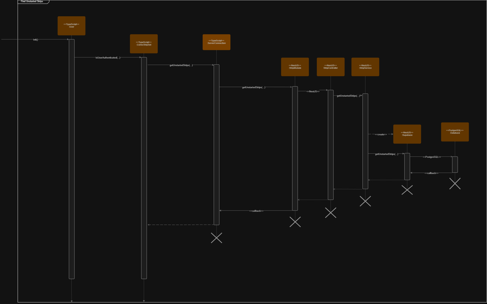
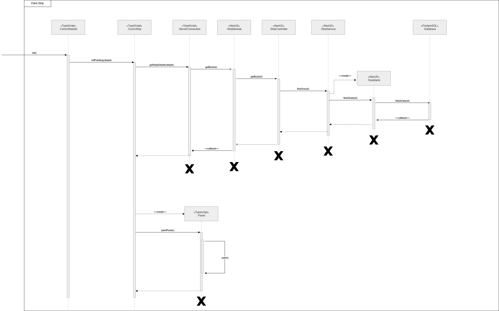
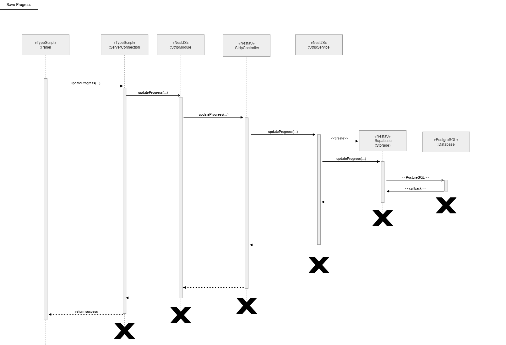
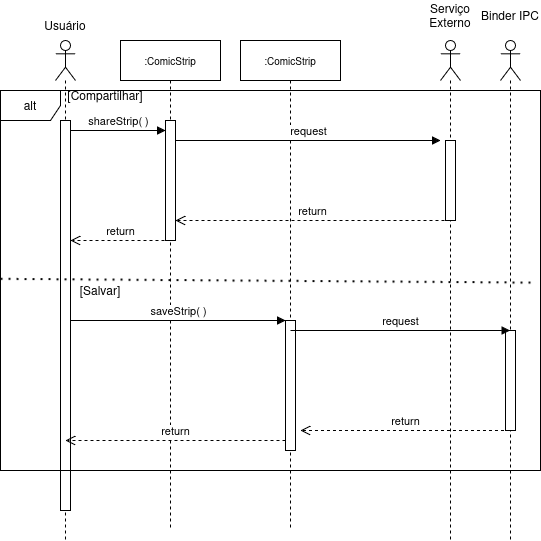
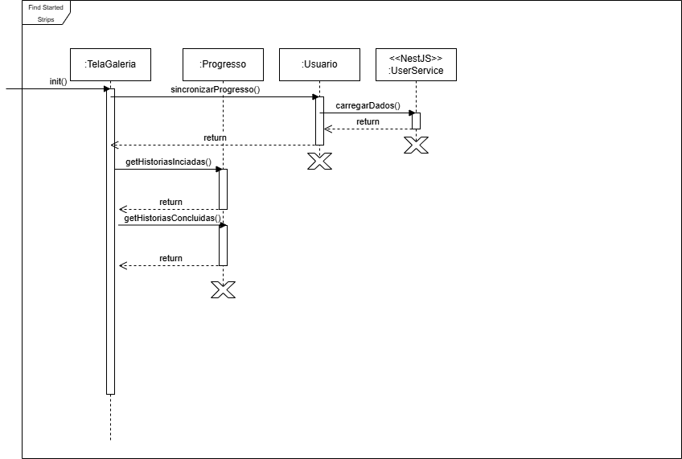
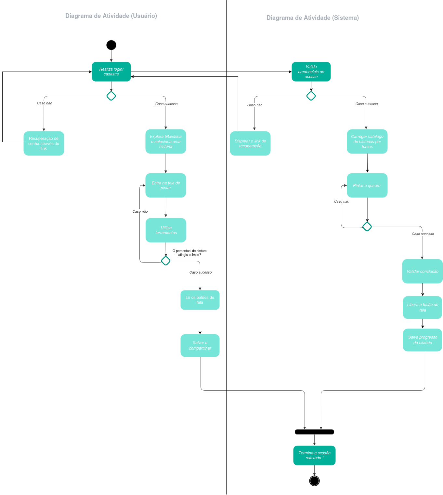
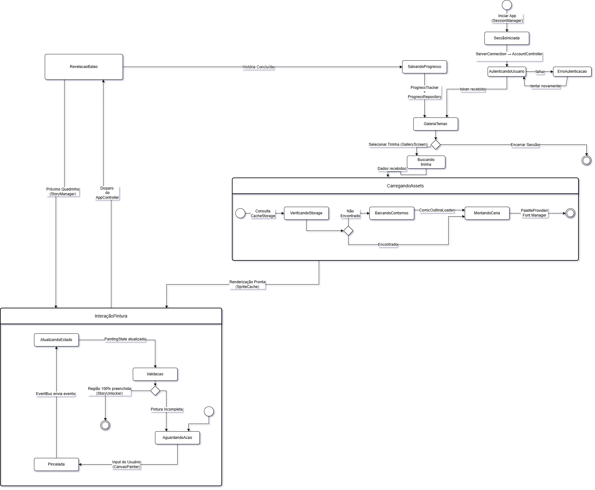

# 2.2. Módulo Modelagem Dinâmica UML

## Participantes

Tabela 1: Participantes

<table>
  <thead>
    <tr>
      <th>Nome</th>
      <th>Função</th>
      <th>Data</th>
      <th>Hora</th>
    </tr>
  </thead>
  <tbody>
    <tr>
      <td><a href="https://github.com/SamaraAlvess">Maria Samara Alves </a></td>
      <td><a href="#/Modelagem/2.2.ModelagemDinamica?id=atividade">Diagrama de Atividades</a></td>
      <td>21/04/2026</td>
      <td>15:30</td>
    </tr>
    <tr>
      <td><a href="https://github.com/anawcarol">Ana Carolina Fialho</a></td>
      <td><a href="#/Modelagem/2.2.ModelagemDinamica?id=atividade">Diagrama de Atividades</a></td>
      <td>21/04/2026</td>
      <td>15:30</td>
    </tr>
    <tr>
      <td><a href="https://github.com/GabrielSPinto">Gabriel Pinto</a></td>
      <td><a href="#/Modelagem/2.2.ModelagemDinamica?id=atividade">Diagrama de Atividades</a></td>
      <td>21/04/2026</td>
      <td>15:30</td>
    </tr>    
    <tr>
      <td><a href="https://github.com/YasminDayrell">Yasmin Dayrell</a></td>
      <td>Diagrama de Sequência</td>
      <td>23/04/2026</td>
      <td>10:00</td>
    </tr>
    <tr>
      <td><a href="https://github.com/DaviNegreiros">Davi Negreiros</a></td>
      <td>Diagrama de Sequência</td>
      <td>23/04/2026</td>
      <td>10:00</td>
    </tr>
    <tr>
      <td><a href="https://github.com/GFlyan">Guilherme Flyan</a></td>
      <td>Diagrama de Sequência</td>
      <td>23/04/2026</td>
      <td>10:00</td>
    </tr>
    <tr>
      <td><a href="https://github.com/Marjoriemitzi">Marjorie Mitzi</a></td>
      <td>Diagrama de Sequência</td>
      <td>23/04/2026</td>
      <td>10:00</td>
    </tr>
        <tr>
      <td><a href="https://github.com/daisha19">Raissa Silva</a></td>
      <td>Diagrama de Estados</td>
      <td>23/04/2026</td>
      <td>18:00</td>
    </tr>
        <tr>
      <td><a href="https://github.com/JoaoMarceloGCN">João Marcelo</a></td>
      <td>Diagrama de Estados</td>
      <td>23/04/2026</td>
      <td>18:00</td>
    </tr>
        <tr>
      <td><a href="https://github.com/pedrohpsantos">Pedro Henrique</a></td>
      <td>Diagrama de Estados</td>
      <td>23/04/2026</td>
      <td>18:00</td>
    </tr>
  </tbody>
</table>

Fonte: Equipe do Projeto, 2026.

## Introdução

Na UML (Linguagem de Modelagem Unificada), a modelagem dinâmica é responsável por descrever o comportamento de um sistema ao longo do tempo. Diferente da modelagem estática, que enfatiza a estrutura, essa abordagem busca representar como os objetos interagem entre si e como seus estados se modificam diante de determinados eventos. Dessa forma, ela permite visualizar o fluxo de execução e a lógica que orienta o funcionamento do sistema.

## Metodologia

A metodologia aplicada pelo grupo se baseou em três representações principais da modelagem dinâmica em UML:

1. **Diagrama de Sequência** – Apresenta as interações entre objetos ao longo do tempo, evidenciando a troca de mensagens e a ordem em que elas ocorrem durante a execução de um processo.

2. **Diagrama de Atividades** –  Descreve o fluxo de ações dentro de um sistema ou processo, destacando a sequência de tarefas e possíveis ramificações, de forma semelhante a um fluxograma.

3. **Diagrama de Estados** – Descreve o fluxo de ações dentro de um sistema ou processo, destacando a sequência de tarefas e possíveis ramificações, de forma semelhante a um fluxograma.

## 1. Diagrama de Sequência

O diagrama de sequência é um dos diagramas mais importantes da modelagem dinâmica UML. Seu principal diferencial em relação aos outros diagramas é a cronologia. Ele é um dos poucos diagramas que demonstram a passagem do tempo. Sua funcionalidade principal é entender em qual sequência de mensagens ocorrem entre objetos do sistema para realizar tais funções. Ou como citado por Fábio da Bóson Treinamentos: "O diagrama de sequência é um diagrama que nós utilizamos para enfatizar a troca de mensagens entre objetos."

*Redigido por [Davi Negreiros](https://www.github.com/DaviNegreiros).*

****Representação do Diagrama****

Para simplificar o entendimento, dividimos o diagrama de sequência em cinco diagramas que representam diferentes sequências do nosso projeto. Essas são:
- Autenticação de Usuário
- Visualizar Tirinhas Não Iniciadas
- Pintar Tirinha
- Salvar e Compartilhar Tirinha
- Visualizar Tirinha Iniciadas/Completas

Abaixo estão os 5 diagramas de sequência desenvolvidos para o projeto:

**Autenticação de Usuário**

[Link Draw.io: Diagrama de Sequência Autenticação de Usuário](https://drive.google.com/file/d/1fF6VLbHMo7P8NAymSDiuqILawzG0boig/view?usp=drive_link)

| Autores            | Função                               |
|--------------------|--------------------------------------|
| Guilherme Flyan    | Fatoração e refatoração do artefato  |
| Yasmin Dayrell     | Revisão                              |
| Marjorie Mitzi     | Revisão                              |

**Visualizar Tirinhas Não Iniciadas**

[Link Draw.io: Diagrama de Sequência Tirinhas Não Iniciadas](https://drive.google.com/file/d/1fF6VLbHMo7P8NAymSDiuqILawzG0boig/view?usp=sharing)

| Autores            | Função                               |
|--------------------|--------------------------------------|
| Guilherme Flyan    | Fatoração e refatoração do artefato  |
| Yasmin Dayrell     | Revisão                              |
| Marjorie Mitzi     | Revisão                              |

**Pintar Tirinha**

[Link Draw.io: Diagrama de Sequência Pintar Tirinha](https://drive.google.com/file/d/1ZabPkqi7FntKYCgmMqU9_f2wIx9GAdb7/view)

*Explicação do diagrama:* O fluxo começa com o ComicStripSet acionando o ComicStrip para iniciar a pintura. Para carregar a imagem, o ComicStrip solicita os detalhes da história ao ServerConnection, que faz a ponte com o backend (StripModule, StripController e StripService). O serviço então busca esses dados no banco de dados através do Supabase. Com as informações em mãos, o ComicStrip consegue gerar o quadrinho (Panel) e ativar a função paintPanel(), permitindo que a interação aconteça.
*Redigido por [Marjorie Mitzi](https://www.github.com/Marjoriemitzi).*

| Autores            | Função                               |
|--------------------|--------------------------------------|
| Marjorie Mitzi     | Fatoração e refatoração do artefato  |
| Guilherme Flyan    | Fatoração e refatoração do artefato  |
| Yasmin Dayrell     | Revisão                              |

**Salvar Progresso**

[Link Draw.io: Diagrama de Sequência Salvar Progresso](https://drive.google.com/file/d/1te1TD6B1LmJtaYxdCYtHfdNkBYxyGdU3/view)

Explicação do diagrama:*Para registrar o avanço do usuário, o quadrinho (Panel) envia a nova atualização chamando updateProgress() no ServerConnection. Essa requisição atravessa a API do backend (StripModule e StripController) até chegar no StripService, que aciona o Supabase para gravar a alteração direto no banco PostgreSQL. Assim que o banco salva tudo, ele devolve um aviso de sucesso que faz o caminho inverso até o painel, confirmando a operação.
*Redigido por [Marjorie Mitzi](https://www.github.com/Marjoriemitzi).*

| Autores            | Função                               |
|--------------------|--------------------------------------|
| Yasmin Dayrell     | Revisão                              |  
| Guilherme Flyan    | Fatoração e refatoração do artefato  |
| Marjorie Mitzi     | Fatoração e refatoração do artefato  |

**Salvar e Compartilhar Tirinha**

[Link Draw.io: Diagrama de Sequência Salvar e Compartilhar Tirinha](https://drive.google.com/file/d/1CPY2IfbZAIPFBa1F68EWCCxFv4bMxEwA/view?usp=sharing)

| Autores            | Função                               |
|--------------------|--------------------------------------|
| Yasmin Dayrell     | Fatoração e refatoração do artefato  |
| Davi Negreiros     | Fatoração                            |
| Guilherme Flyan    | Revisão                              |
| Marjorie Mitzi     | Revisão                              |

**Visualizar Tirinha Iniciadas/Completas**

[Link Draw.io: Diagrama de Sequência Tirinha Iniciadas/Completas](https://drive.google.com/file/d/1CPY2IfbZAIPFBa1F68EWCCxFv4bMxEwA/view?usp=sharing)

*Explicação do diagrama:* Ao entrar na TelaGaleria o objeto chama a função sincronizarProgresso() enviando um chamado ao objeto Usuario que por sua vez chama a função carregarDados() que busca os dados do usuários salvos no backend, mais especificamente no modulo UserService. UserService retorna esses dados ao Usuario, Usuario retorna ao TelaGaleria que, agora com os dados do usuário, tem os dados sobre o progresso do usuário em relação as historias. Após tudo isso, a TelaGaleria chama a função getHistoriasIniciadas() e depois getHistoriasConcluidas(), recebendo o retorno das duas funções do objeto Progresso. Objeto o qual já possui uma lista com todas as histórias salvas, já que já consultão o backend e o banco no início do aplicativo. Agora TelaGaleria possui todas as historias iniciadas/concluidas e pode exibí-las de forma correta ao usuário.

| Autores            | Função                               |
|--------------------|--------------------------------------|
| Davi Negreiros     | Fatoração                            |
| Yasmin Dayrell     | Revisão                              |

**Opiniões pessoais:**

| Nome | Artefato | Opinião |
| :--- | :--- | :--- |
| **Yasmin Dayrell** | Diagrama de Sequência | A construção e revisão dos diagramas de sequência ajudou a entender melhor como os componentes do sistema se comunicam durante a execução das funcionalidades. A principal dificuldade foi organizar corretamente a ordem das mensagens entre usuário, interface e backend, garantindo que o fluxo representasse o comportamento esperado da aplicação.|
| **Davi Negreiros** | Diagrama de Sequência | Interessante, mas bem complicado. Eu já tinha visto diagrama de sequência quando fiz S. de Multi-Agentes, porém pensar dessa forma com um sistema inteiro e que ainda não existe de verdade é bem mais complexo. Entretanto eu gosto bastante dessa forma de ver a troca de mensagens entre os objetos do sistema. |
| **Guilherme Flyan** | Diagrama de Sequência |  |
| **Marjorie Mitzi** | Diagrama de Sequência | Desenhar exatamente como a requisição sai da interface, atravessa os controladores e serviços no NestJS e bate lá no PostgreSQL via Supabase nos obrigou a prever gargalos e entender o fluxo de dados de ponta a ponta antes mesmo de escrever a primeira linha de código. |

## 2. Diagrama de Atividades :id=atividades

O diagrama de atividades é uma ferramenta visual que representa o fluxo de trabalho ou processo dentro de um sistema. Ele destaca as atividades, decisões e ramificações que ocorrem durante a execução de uma funcionalidade, permitindo uma compreensão clara do comportamento dinâmico do sistema.

****Como o diagrama agrega ao projeto****
A utilização do diagrama de atividades é fundamental para:
- Mapear o fluxo de ações e decisões dentro do sistema;
- Identificar possíveis pontos de melhoria ou otimização no processo;
- Facilitar a comunicação entre os membros da equipe, proporcionando uma visão clara do funcionamento do sistema;
- Auxiliar na implementação ao fornecer um guia visual do processo a ser seguido.

| Autores | Função | 
| :--- | :--- |
| [Ana Carolina Madeira Fialho](https://github.com/anawcarol) | Fatoração |
| [Gabriel Santos Pinto](https://github.com/GabrielSPinto) | Revisão |
| [Maria Samara Alves ](https://github.com/SamaraAlvess) | Fatoração |

### Representação do Diagrama :id=atividade

A seguir, apresentamos o diagrama de atividades desenvolvido pelo grupo:

<em>Figura 2: Diagrama de Atividades</em>

<em>Fonte: Maria Samara Alves, Ana Carolina e Gabriel Pinto, 2026.</em>

[Link Draw.io: Diagrama de Atividades](https://drive.google.com/file/d/1NV_6Qy7LFXESal_OKzGU_2ZYr8eijR_M/view?usp=sharin)

**Opiniões pessoais:**

| Nome | Artefato | Opinião |
| :--- | :--- | :--- |
| **Maria Samara Alves** | Diagrama de Atividades | O diagrama de atividades foi a tarefa mais divertidade da entrega, dividir a visão do produto em "usuário" e "sistema" abriu novos caminhos para enterdemos melhor como podemos trabalhar com o fluxo de desenvolvimento.  |
| **Ana Carolina Fialho** | Diagrama de Atividades | Durante a construção do diagrama de atividades, percebi a importância de representar visualmente cada etapa do processo para facilitar o entendimento da equipe. O desafio principal foi transformar as funcionalidades do sistema em um fluxo simples e bem estruturado, evitando informações excessivas e mantendo a clareza do modelo. |
| **Gabriel Santos Pinto** | Diagrama de Atividades | A revisão do diagrama de atividades permitiu identificar pontos em que o fluxo poderia ser melhorado para representar melhor a navegação do usuário. O artefato contribuiu para alinhar a visão da equipe sobre o funcionamento da aplicação e serviu como apoio para validar se as etapas estavam organizadas de maneira lógica. |

## 3. Diagrama de Estados
Fluxo de Execução e Estados

### 3.1. Inicialização do Sistema
Responsável por preparar o ambiente antes da interação do usuário.

Etapas:

- Iniciar App (*SessionManager*): inicializa a aplicação e a sessão do usuário.
- *SessaoIniciada*: estado indicando que a sessão foi criada com sucesso.

Transição:
O sistema inicia o processo de autenticação com o *backend*.

### 3.2. Autenticação
Responsável por verificar a identidade do usuário junto ao *backend* antes de exibir conteúdo.

Etapas:

*AutenticandoUsuario*: o *ServerConnection* realiza uma chamada ao *AccountController* no *backend* NestJS.

Decisão:

- Token recebido → sistema segue para *GaleriaTemas*.
- Falha → sistema entra em *ErroAutenticacao* e permite nova tentativa.

### 3.3. Navegação e Seleção de História
Responsável pela escolha do conteúdo a ser exibido.

Etapas:

*GaleriaTemas*: exibe as histórias disponíveis.
Selecionar Tirinha (*GalleryScreen*): usuário escolhe uma história.

Transição:
Inicia o processo de busca da tirinha no *backend*.

### 3.4. Busca da Tirinha no Backend
Responsável por recuperar os dados da tirinha selecionada antes de carregar os assets.

Etapas:

BuscandoTirinha: o *ServerConnection* realiza uma chamada ao *StripController* no backend NestJS.

Decisão:

- Dados recebidos → sistema segue para *CarregandoAssets*.
- Falha → sistema entra em *ErroCarregamento* e retorna para *GaleriaTemas*.

### 3.5. Carregamento de Assets (Pipeline de Renderização)
Responsável por preparar todos os recursos necessários para exibir o quadrinho.

Etapas:

*VerificandoStorage*: consulta o *CacheStore* para verificar se os arquivos já existem.

- Encontrado → segue direto para montagem.
- Não encontrado → inicia download.

- *BaixandoContornos*: utiliza o *ComicOutlineLoader* para obter os assets.
- *MontandoCena*: integra contornos (*ComicOutlineLoader*), paleta (*PaletteProvider*) e fontes (*FontManager*).
- *Renderização Pronta* (*SpriteCache*): *Assets* são preparados para uso na interface.

### 3.6. Interação de Pintura (Loop Principal)
Responsável pela interação contínua do usuário com o sistema.

Estados internos:

- *AguardandoAcao*: sistema espera input do usuário (*CanvasPainter*).
- Pincelada: usuário realiza uma ação de pintura.
- *AtualizandoEstado*: o *EventBus* envia o evento para o *Model* e o *PaintingState* é atualizado.
- *Validacao*: o *StoryUnlocker* verifica o progresso da pintura.

- Pintura incompleta → retorna para *AguardandoAcao* (loop continua).
- Região 100% preenchida → sistema sai do subestado e transiciona para *SalvandoProgresso*.

### 3.7. Persistência de Dados
Responsável por salvar o progresso do usuário após a conclusão de uma região.

Etapas:

*SalvandoProgresso*: executado após região completada.

Componentes envolvidos: *ProgressTracker* e *ProgressRepository*.
Resultado: dados são armazenados no banco local.

### 3.8. Conclusão da História
Responsável pelo fechamento do fluxo de uma tirinha.

Etapas:
- *RevelacaoBalao*: diálogos são exibidos ao usuário.
- Próximo Quadrinho (*StoryManager*): sistema prepara a próxima parte da história ou retorna para *GaleriaTemas* caso seja o último quadrinho.

### 3.9. Encerramento de Sessão
Responsável pelo término da execução do sistema.

Etapa:
Encerrar Sessão: disponível a partir de *GaleriaTemas*, finaliza o ciclo do usuário no aplicativo.

Representação do Diagrama

Abaixo será apresentado o diagrama de estados desenvolvido pelo grupo [Draw.io](https://drive.google.com/file/d/1s1tzIYcVYhgJuJa5TDxM3dQNAzQttVXF/view?usp=sharing):

| Autores            | Função                               |
|--------------------|--------------------------------------|
| João Marcelo       | Fatoração, diagramação e revisão     |
| Raissa Oliveira    | Fatoração, diagramação e revisão     |
| Pedro Henrique     | Fatoração, diagramação e revisão     |

**Comentários sobre o trabalho em Equipe**

O diagrama de estados foi desenvolvido em reunião remota pelo Microsoft Teams, com os três membros participando ativamente da modelagem no draw.io. O principal desafio enfrentado pelo grupo foi mapear corretamente os estados relacionados à comunicação com o backend, resultando na inclusão dos estados AutenticandoUsuario e BuscandoTirinha, que representam as chamadas ao AccountController e ao StripController respectivamente. A modelagem do subestado composto InteraçãoPintura também exigiu atenção especial do grupo para garantir que o loop de pintura e as transições de saída estivessem coerentes com o fluxo geral da aplicação. O grupo considera que o diagrama representa de forma satisfatória o comportamento dinâmico do sistema, reconhecendo que estados de erro e recuperação poderiam ser explorados com maior profundidade.

**Opiniões pessoais:**

| Nome | Artefato | Opinião |
| :--- | :--- | :--- |
| **Raissa Silva de Oliveira** | Diagrama de Estados | A maior dificuldade inicial no diagrama de estados foi definir transições e distinguir estados simples de subestados compostos. Por meio de pesquisa e revisões práticas, o diagrama tornou-se mais fiel ao comportamento dinâmico do sistema, consolidando o aprendizado sobre o fluxo da aplicação. |
| **João Marcelo Guimarães** | Diagrama de Estados | Sobre o diagrama de estados, tive dificuldade inicial para organizar corretamente os fluxos e transições, especialmente nos estados relacionados à comunicação com o backend. Com o avanço do trabalho, ficou mais claro como representar o comportamento do sistema. A parte de interação de pintura exigiu mais cuidado, mas contribuiu para um entendimento melhor da dinâmica da aplicação. |
| **Pedro Henrique Pereira** | Diagrama de Estados | A elaboração do diagrama de estados foi desafiadora, mas importante para identificar funções ausentes e mapear o comportamento do sistema. Embora a complexidade das notações dificulte a leitura em alguns momentos, o trabalho em grupo foi fundamental para superar esses obstáculos, garantindo a qualidade do modelo e o alinhamento da equipe. |

### Referências

>>Curso de UML - O que é um Diagrama de Sequência. Disponível em: https://www.youtube.com/watch?v=UVkj3ed0ZuM&t=1s  
Acesso em: 23 abr. 2026.
>>SERRANO, Milene. *Modelagem Dinâmica em UML* (slides de aula). Universidade de Brasília (UnB). Material disponibilizado em sala de aula.

## Histórico de Versões 

| Versão | Data | Descrição | Autor(es) | Revisor(es) |
| :--: | :--: | :--: | :--: | :--: |
| 1.0 | 23/04/2026 | Criação da página | [Maria Samara Alves](https://github.com/SamaraAlvess) | [Marjorie](https://github.com/Marjoriemitzi) |
| 2.0 | 23/04/2026 | Adição da introdução e estrura do arquivo | [Yasmin Dayrell](https://github.com/YasminDayrell) | [Marjorie](https://github.com/Marjoriemitzi) |
| 2.1 | 23/04/2026 | Adição do diagrama de sequência (Salvar e compartilhar) | [Yasmin Dayrell](https://github.com/YasminDayrell) | [Marjorie](https://github.com/Marjoriemitzi) |
| 2.2 | 23/04/2026 | Adição do diagrama de Atividades | [Maria Samara Alves](https://github.com/SamaraAlvess) e [Ana Carolina](https://github.com/anawcarol)  | [Gabriel Pinto](https://github.com/GabrielSPinto) |
| 2.3 | 23/04/2026 | Adição de todos os diagramas sequenciais | [Davi Negreiros](https://github.com/DaviNegreiros)| [Yasmin Dayrell](https://github.com/YasminDayrell) |
| 2.4 | 23/04/2026 | Ajuste da página | [Gabriel Pinto](https://github.com/GabrielSPinto)| [Maria Samara Alves](https://github.com/SamaraAlvess) |
| 2.5 | 24/04/2026 | Modificação do diagrama de sequencia | [Marjorie](https://github.com/Marjoriemitzi) | [Guilherme](https://github.com/GFlyan) | 
| 2.6 | 24/04/2026 | Ajustes introdução, negritos, participação pessoal e diagrama de sequência | [Davi Negreiros](https://github.com/DaviNegreiros) |  | 
| 2.7 | 24/04/2026 | Ajustes na documentação | [Maria Samara Alves](https://github.com/SamaraAlvess) | [Gabriel Pinto](https://github.com/GabrielSPinto) |
[Marjorie](https://github.com/Marjoriemitzi)