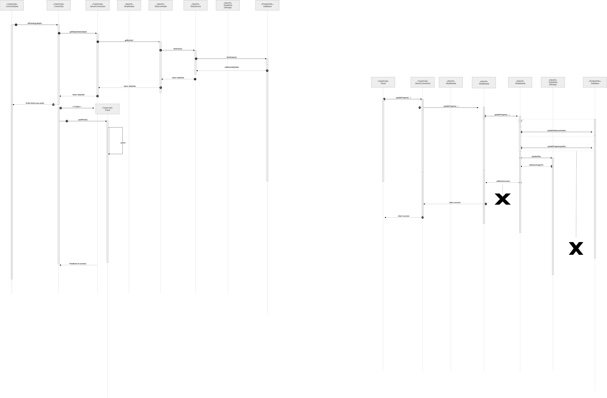

# 2.2. Módulo Modelagem Dinâmica UML

## Participantes

Tabela 1: Participantes

<table>
  <thead>
    <tr>
      <th>Nome</th>
      <th>Função</th>
      <th>Data</th>
      <th>Hora</th>
    </tr>
  </thead>
  <tbody>
    <tr>
      <td><a href="https://github.com/SamaraAlvess">Samara Alves</a></td>
      <td>Diagrama de Atividades</td>
      <td>21/04/2026</td>
      <td>15:30</td>
    </tr>
    <tr>
      <td><a href="https://github.com/anawcarol">Ana Carolina Fialho</a></td>
      <td>Diagrama de Atividades</td>
      <td>21/04/2026</td>
      <td>15:30</td>
    </tr>
    <tr>
      <td><a href="https://github.com/GabrielSPinto">Gabriel Pinto</a></td>
      <td>Diagrama de Atividades</td>
      <td>21/04/2026</td>
      <td>15:30</td>
    </tr>    
    <tr>
      <td><a href="https://github.com/YasminDayrell">Yasmin Dayrell</a></td>
      <td>Diagrama de Sequência</td>
      <td>23/04/2026</td>
      <td>10:00</td>
    </tr>
    <tr>
      <td><a href="https://github.com/DaviNegreiros">Davi Negreiros</a></td>
      <td>Diagrama de Sequência</td>
      <td>23/04/2026</td>
      <td>10:00</td>
    </tr>
    <tr>
      <td><a href="https://github.com/GFlyan">Guilherme Flyan</a></td>
      <td>Diagrama de Sequência</td>
      <td>23/04/2026</td>
      <td>10:00</td>
    </tr>
    <tr>
      <td><a href="https://github.com/Marjoriemitzi">Marjorie Mitzi</a></td>
      <td>Diagrama de Sequência</td>
      <td>23/04/2026</td>
      <td>10:00</td>
    </tr>
  </tbody>
</table>

Fonte: Equipe do Projeto, 2026.

## Introdução

Na UML (Linguagem de Modelagem Unificada), a modelagem dinâmica é responsável por descrever o comportamento de um sistema ao longo do tempo. Diferente da modelagem estática, que enfatiza a estrutura, essa abordagem busca representar como os objetos interagem entre si e como seus estados se modificam diante de determinados eventos. Dessa forma, ela permite visualizar o fluxo de execução e a lógica que orienta o funcionamento do sistema.

## Metodologia

A metodologia aplicada pelo grupo se baseou em três representações principais da modelagem dinâmica em UML:

1. **Diagrama de Sequência** – Apresenta as interações entre objetos ao longo do tempo, evidenciando a troca de mensagens e a ordem em que elas ocorrem durante a execução de um processo.

2. **Diagrama de Atividades** –  Descreve o fluxo de ações dentro de um sistema ou processo, destacando a sequência de tarefas e possíveis ramificações, de forma semelhante a um fluxograma.

3. **Diagrama de Estados** – Descreve o fluxo de ações dentro de um sistema ou processo, destacando a sequência de tarefas e possíveis ramificações, de forma semelhante a um fluxograma.

## 1. Diagrama de Sequência

O diagrama de sequência é um dos principais artefatos da modelagem dinâmica em UML, sendo utilizado para representar a interação entre diferentes objetos ao longo do tempo. Ele evidencia a troca de mensagens entre os participantes de um sistema, destacando a ordem em que essas interações ocorrem e como contribuem para a execução de uma funcionalidade específica.

### Como o diagrama agrega ao projeto

A utilização do diagrama de sequência contribui para uma melhor compreensão do comportamento do sistema, permitindo:

- Visualizar claramente a comunicação entre os componentes;
- Identificar a ordem de execução das operações;
- Detectar possíveis inconsistências ou gargalos na lógica do sistema;
- Facilitar a implementação ao fornecer uma visão temporal detalhada das interações.

### Representação do Diagrama

Para simplificar o entendimento, dividimos o diagrama de sequência em cinco diagramas que representam diferentes sequências do nosso projetoiis. Essas são:
- Autenticação de Usuário
- Visualizar Tirinhas Não Iniciadas
- Pintar Tirinha
- Salvar e Compartilhar Tirinha
- Visualizar Tirinha Iniciadas/Completas

Abaixo serão apresentados os diagramas de sequência desenvolvidos pelo grupo:
#### Autenticação de Usuário

[Link Draw.io: Diagrama de Sequência Autenticação de Usuário](https://drive.google.com/file/d/1fF6VLbHMo7P8NAymSDiuqILawzG0boig/view?usp=drive_link)
| Autores            | Função                               |
|--------------------|--------------------------------------|
| Guilherme Flyan    | Fatoração e refatoração do artefato  |
| Yasmin Dayrell     | Revisão                              |
| Marjorie Mitzi     | Revisão                              |

#### Visualizar Tirinhas Não Iniciadas

[Link Draw.io: Diagrama de Sequência Tirinhas Não Iniciadas](https://drive.google.com/file/d/1kZvKoHEWN-55XFJj6XSgVHjCotfKxwnA/view?usp=drive_link)

| Autores            | Função                               |
|--------------------|--------------------------------------|
| Guilherme Flyan    | Fatoração e refatoração do artefato  |
| Yasmin Dayrell     | Revisão                              |
| Marjorie Mitzi     | Revisão                              |

#### Pintar Tirinha

[Link Draw.io: Diagrama de Sequência Pintar Tirinha](https://drive.google.com/file/d/1ZabPkqi7FntKYCgmMqU9_f2wIx9GAdb7/view?usp=sharing)
| Autores            | Função                               |
|--------------------|--------------------------------------|
| Marjorie Mitzi     | Fatoração                            |
| Guilherme Flyan    | Revisão                              |
| Yasmin Dayrell     | Revisão                              |

#### Salvar e Compartilhar Tirinha

[Link Draw.io: Diagrama de Sequência Salvar e Compartilhar Tirinha](https://drive.google.com/file/d/1CPY2IfbZAIPFBa1F68EWCCxFv4bMxEwA/view?usp=sharing)

| Autores            | Função                               |
|--------------------|--------------------------------------|
| Yasmin Dayrell     | Fatoração e refatoração do artefato  |
| Davi Negreiros     | Fatoração                            |
| Guilherme Flyan    | Revisão                              |
| Marjorie Mitzi     | Revisão                              |

### Comentários sobre o trabalho em equipe

- Yasmin: O diagrama de Sequência, em minha análise, foi o mais desafiador, exigindo domínio do projeto e de notações UML. A revisão e compartilhamento de aprendizados foi essencial para refatorar e refinar o artefato.

## Diagrama de Estados
Fluxo de Execução e Estados

## *1. Inicialização do Sistema*
Responsável por preparar o ambiente antes da interação do usuário.

### Etapas:

- Iniciar App (*SessionManager*): inicializa a aplicação e a sessão do usuário.
- *SessaoIniciada*: estado indicando que a sessão foi criada com sucesso.

### Transição:
O sistema inicia o processo de autenticação com o *backend*.

## 2. *Autenticação*
Responsável por verificar a identidade do usuário junto ao *backend* antes de exibir conteúdo.

### Etapas:

*AutenticandoUsuario*: o *ServerConnection* realiza uma chamada ao *AccountController* no *backend* NestJS.

### Decisão:

- Token recebido → sistema segue para *GaleriaTemas*.
- Falha → sistema entra em *ErroAutenticacao* e permite nova tentativa.

## *3. Navegação e Seleção de História*
Responsável pela escolha do conteúdo a ser exibido.

### Etapas:

*GaleriaTemas*: exibe as histórias disponíveis.
Selecionar Tirinha (*GalleryScreen*): usuário escolhe uma história.

### Transição:
Inicia o processo de busca da tirinha no *backend*.

## *4. Busca da Tirinha no Backend* 
Responsável por recuperar os dados da tirinha selecionada antes de carregar os assets.

### Etapas:

BuscandoTirinha: o *ServerConnection* realiza uma chamada ao *StripController* no backend NestJS.

### Decisão:

- Dados recebidos → sistema segue para *CarregandoAssets*.
- Falha → sistema entra em *ErroCarregamento* e retorna para *GaleriaTemas*.

## *5. Carregamento de Assets (Pipeline de Renderização)*
Responsável por preparar todos os recursos necessários para exibir o quadrinho.

### Etapas:

*VerificandoStorage*: consulta o *CacheStore* para verificar se os arquivos já existem.

- Encontrado → segue direto para montagem.
- Não encontrado → inicia download.

- *BaixandoContornos*: utiliza o *ComicOutlineLoader* para obter os assets.
- *MontandoCena*: integra contornos (*ComicOutlineLoader*), paleta (*PaletteProvider*) e fontes (*FontManager*).
- *Renderização Pronta* (*SpriteCache*): *Assets* são preparados para uso na interface.

## *6. Interação de Pintura (Loop Principal)*
Responsável pela interação contínua do usuário com o sistema.

### Estados internos:

- *AguardandoAcao*: sistema espera input do usuário (*CanvasPainter*).
- Pincelada: usuário realiza uma ação de pintura.
- *AtualizandoEstado*: o *EventBus* envia o evento para o *Model* e o *PaintingState* é atualizado.
- *Validacao*: o *StoryUnlocker* verifica o progresso da pintura.

- Pintura incompleta → retorna para *AguardandoAcao* (loop continua).
- Região 100% preenchida → sistema sai do subestado e transiciona para *SalvandoProgresso*.

## 7. *Persistência de Dados*
Responsável por salvar o progresso do usuário após a conclusão de uma região.

### Etapas:

*SalvandoProgresso*: executado após região completada.

Componentes envolvidos: *ProgressTracker* e *ProgressRepository*.
Resultado: dados são armazenados no banco local.

## 8. Conclusão da História
Responsável pelo fechamento do fluxo de uma tirinha.

### Etapas:
- *RevelacaoBalao*: diálogos são exibidos ao usuário.
- Próximo Quadrinho (*StoryManager*): sistema prepara a próxima parte da história ou retorna para *GaleriaTemas* caso seja o último quadrinho.

## 9. Encerramento de Sessão
Responsável pelo término da execução do sistema.

### Etapa:
Encerrar Sessão: disponível a partir de *GaleriaTemas*, finaliza o ciclo do usuário no aplicativo.

### Representação do Diagrama

Abaixo será apresentado o diagrama de estados desenvolvido pelo grupo [Draw.io](https://drive.google.com/file/d/1s1tzIYcVYhgJuJa5TDxM3dQNAzQttVXF/view?usp=sharing):

| Autores            | Função                               |
|--------------------|--------------------------------------|
| João Marcelo       | Fatoração, diagramação e revisão     |
| Raissa Oliveira    | Fatoração, diagramação e revisão     |
| Pedro Henrique     | Fatoração, diagramação e revisão     |

### Comentários sobre o trabalho em Equipe
O diagrama de estados foi desenvolvido em reunião remota pelo Microsoft Teams, com os três membros participando ativamente da modelagem no draw.io. O principal desafio enfrentado pelo grupo foi mapear corretamente os estados relacionados à comunicação com o backend, resultando na inclusão dos estados AutenticandoUsuario e BuscandoTirinha, que representam as chamadas ao AccountController e ao StripController respectivamente. A modelagem do subestado composto InteraçãoPintura também exigiu atenção especial do grupo para garantir que o loop de pintura e as transições de saída estivessem coerentes com o fluxo geral da aplicação. O grupo considera que o diagrama representa de forma satisfatória o comportamento dinâmico do sistema, reconhecendo que estados de erro e recuperação poderiam ser explorados com maior profundidade.

### Opiniões pessoais:

| | |
| :--- | :---: |
|  **Raissa Silva de Oliveira** |A maior dificuldade inicial no diagrama de estados foi definir transições e distinguir estados simples de subestados compostos. Através de pesquisa e revisões práticas, o diagrama tornou-se fiel ao comportamento dinâmico do sistema, consolidando o aprendizado sobre o fluxo da aplicação.|
|  **João Marcelo Guimarães** |Sobre o diagrama de estados, tive dificuldade inicial para organizar corretamente os fluxos e transições, especialmente nos estados relacionados à comunicação com o backend. Com o avanço do trabalho ficou um pouco mais claro como representar o comportamento do sistema. A parte de interação de pintura exigiu mais cuidado, mas contribuiu para um entendimento melhor da dinâmica da aplicação.|
|  **Pedro Henrique Pereira** |A elaboração do diagrama de estados foi desafiadora, mas reveladora para identificar funções ausentes e mapear o comportamento do sistema. Embora a complexidade das notações dificulte a leitura, o trabalho em grupo foi fundamental para superar esses obstáculos, garantindo a qualidade do modelo e o alinhamento da equipe.
|

### Referências

>>Curso de UML - O que é um Diagrama de Sequência. Disponível em: https://www.youtube.com/watch?v=UVkj3ed0ZuM&t=1s  
Acesso em: 23 abr. 2026.
>>SERRANO, Milene. *Modelagem Dinâmica em UML* (slides de aula). Universidade de Brasília (UnB). Material disponibilizado em sala de aula.

## Histórico de Versões 📅

| Versão | Data | Descrição | Autor(es) | Revisor(es) |
| :--: | :--: | :--: | :--: | :--: |
| 1.0 | 23/04/2026 | Criação da página | [Samara Alves](https://github.com/SamaraAlvess) | [Marjorie](https://github.com/Marjoriemitzi) |
| 2.0 | 23/04/2026 | Adição da introdução e estrura do arquivo | [Yasmin Dayrell](https://github.com/YasminDayrell) | [Marjorie](https://github.com/Marjoriemitzi) |
| 2.1 | 23/04/2026 | Adição do diagrama de sequência (Salvar e compartilhar) | [Yasmin Dayrell](https://github.com/YasminDayrell) | [Marjorie](https://github.com/Marjoriemitzi) |
| 2.2 | 23/04/2026 | Adição do diagrama de Atividades | [Samara Alves](https://github.com/SamaraAlvess) e [Ana Carolina](https://github.com/anawcarol)  | [Gabriel Pinto](https://github.com/GabrielSPinto) |
| 2.3 | 23/04/2026 | Adição de todos os diagramas sequenciais | [Davi Negreiros](https://github.com/DaviNegreiros)| [Yasmin Dayrell](https://github.com/YasminDayrell) |