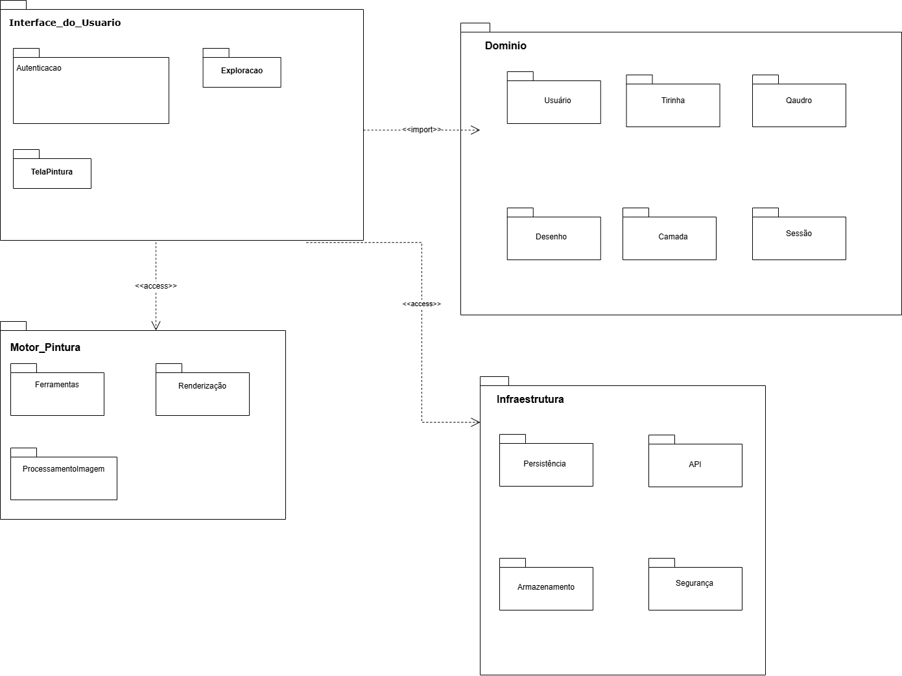
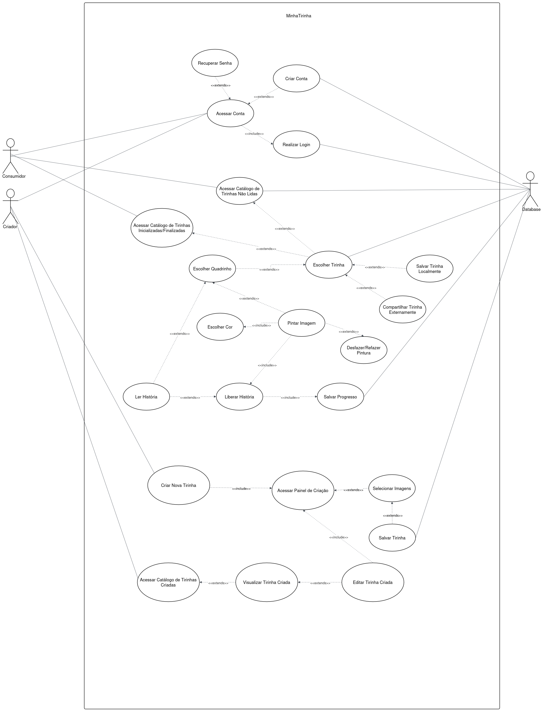

# 2.3. Módulo Notação UML – Modelagem Organizacional ou Casos de Uso

## Participantes

Tabela 1: Participantes

<table>
  <thead>
    <tr>
      <th>Nome</th>
      <th>Função</th>
      <th>Data</th>
      <th>Hora</th>
    </tr>
  </thead>
  <tbody>
    <tr>
      <td><a href="https://github.com/anawcarol">Ana Carolina Madeira Fialho</a></td>
      <td>Diagrama de Pacotes</td>
      <td>21/04/2026</td>
      <td>15:30</td>
    </tr>
    <tr>
      <td><a href="https://github.com/GabrielSPinto">Gabriel Santos Pinto</a></td>
      <td>Diagrama de Pacotes</td>
      <td>19/04/2026</td>
      <td>15:30</td>
    </tr>
    <tr>  
      <td><a href="https://github.com/GFlyan"> Guilherme Flyan</a></td>
      <td>Diagrama de Casos de Uso</td>
      <td>21/04/2026</td>
      <td>15:30</td>    
    </tr> 
    <tr>
      <td><a href="https://github.com/JoaoMarceloGCN">Joao Marcelo Guimaraes Costa Naves</a></td>
      <td>Diagrama de Casos de Uso</td>
      <td>21/04/2026</td>
      <td>15:30</td>
    </tr>
    <tr>
      <td><a href="https://github.com/SamaraAlvess">Maria Samara Alves </a></td>
      <td><a href="#/Modelagem/2.3.ModelagemOrganizacionalCasosDeUso?id=pacotes">Diagrama de Pacotes</a></td>
      <td>21/04/2026</td>
      <td>15:30</td>
    </tr>
    <tr>
      <td><a href="https://github.com/pedrohpsantos">Pedro Henrique Pereira Santos</a></td>
      <td>Diagrama de Casos de Uso</td>
      <td>21/04/2026</td>
      <td>15:30</td>
    </tr>
    <tr>
      <td><a href="https://github.com/Daisha19">Raissa Silva De Oliveira</a></td>
      <td>Diagrama de Pacotes</td>
      <td>21/04/2026</td>
      <td>15:30</td>
    </tr>
    <tr>
      <td><a href="https://github.com/YasminDayrell">Yasmin Dayrell Albuquerque</a></td>
      <td>Diagrama de Casos de Uso</td>
      <td>21/04/2026</td>
      <td>15:30</td>
    </tr>
  </tbody>
</table>

| Nome | Função | Data |
|------|--------|------|
| [Samara Alves](https://github.com/SamaraAlvess) | Diagrama de Pacotes | 21/04/2026 | 
| [Ana Carolina](https://github.com/anawcarol) | Diagrama de Pacotes | 21/04/2026 | 
| [Gabriel Pinto](https://github.com/GabrielSPinto) | Diagrama de Pacotes | 21/04/2026 | 
| [Marjorie](https://github.com/Marjoriemitzi) | Diagrama de Pacotes | 21/04/2026 | 
| [Raissa](https://github.com/daisha19) | Diagrama de Pacotes | 21/04/2026 | 
| [Yasmin Dayrell](https://github.com/YasminDayrell) | Diagrama de Caso de Uso | 23/04/2026 |
| [Guilherme Flyan](https://github.com/GFlyan) | Diagrama de Caso de Uso | 23/04/2026 |
| [Pedro Santos](https://github.com/pedrohpsantos) | Diagrama de Caso de Uso | 23/04/2026 |
| [João Marcelo](https://github.com/JoaoMarceloGCN) | Diagrama de Caso de Uso | 23/04/2026 |

<strong>Tabela 1: Participantes</strong>

## Introdução  

A **modelagem organizacional** na **UML (Unified Modeling Language)** desempenha um papel fundamental na compreensão das interações entre os atores e o sistema, bem como na organização das funcionalidades em níveis estruturais. Diferentemente da modelagem estática, que descreve classes e componentes, essa abordagem concentra-se em identificar quem utiliza o sistema e como suas responsabilidades estão distribuídas.  

Essa perspectiva é essencial para alinhar as expectativas entre usuários, desenvolvedores e gestores, proporcionando uma visão clara das responsabilidades do sistema e de sua organização modular. Para isso, a UML oferece notações específicas, como os **diagramas de casos de uso** e os **diagramas de pacotes**, que auxiliam tanto na análise quanto na comunicação entre os envolvidos no projeto.  

## Metodologia  

A metodologia adotada pelo grupo foi baseada na utilização de duas representações principais da modelagem organizacional em UML:  

- **Diagrama de Casos de Uso**: responsável por representar as interações entre os atores e o sistema, evidenciando as funcionalidades disponíveis e os fluxos de utilização. Esse tipo de diagrama contribui diretamente para a identificação de requisitos e compreensão das necessidades dos usuários.  

- **Diagrama de Pacotes**: utilizado para estruturar o sistema em módulos lógicos, agrupando classes e componentes de acordo com suas responsabilidades. Esse diagrama facilita a visualização da arquitetura do sistema e das relações de dependência entre seus elementos.  

O processo metodológico foi conduzido a partir das seguintes etapas:  

- Identificação dos principais atores que interagem com o sistema;  
- Levantamento dos casos de uso, destacando o valor entregue a cada ator;  
- Organização do sistema em pacotes lógicos, agrupando elementos com funções semelhantes;  
- Elaboração dos diagramas UML, seguindo padrões visuais que garantem consistência e clareza na comunicação.  

## 2.3.1. Diagrama de Pacotes 

### Introdução

O diagrama de pacotes é um dos principais artefatos da modelagem estrutural em UML, sendo utilizado para representar a organização do sistema em módulos lógicos. Ele permite agrupar elementos como classes, interfaces e outros componentes em pacotes, evidenciando a estrutura do sistema e as dependências existentes entre eles.

*Redigido por [Raissa Silva](https://www.github.com/daisha19).*

### Como o diagrama agrega ao projeto

A utilização do diagrama de pacotes contribui para uma melhor compreensão da arquitetura do sistema, permitindo:

- Visualizar a organização modular do sistema;
- Identificar as dependências entre os diferentes pacotes;
- Facilitar a manutenção e evolução do software;
- Promover a separação de responsabilidades entre os componentes;
- Auxiliar no planejamento e na divisão do trabalho em equipe.

<strong>Tabela 2: Participantes</strong>

| Nome | Função | Data |
|------|--------|------|
| [Maria Samara Alves](https://github.com/SamaraAlvess) | Fatoração do artefato | 21/04/2026 | 
| [Ana Carolina](https://github.com/anawcarol) | Fatoração do artefato | 21/04/2026 | 
| [Gabriel Pinto](https://github.com/GabrielSPinto) | Fatoração do artefato | 21/04/2026 | 
| [Marjorie](https://github.com/Marjoriemitzi) | Fatoração do artefato | 21/04/2026 | 
| [Raissa]() | Fatoração do artefato | 21/04/2026 | 

<em>Figura 1: Diagrama de Pacotes</em>

### Representação do Diagrama :id=pacotes

 

<em>Fonte: Maria Samara Alves, Ana Carolina, Gabriel Pinto, Marjorie, Raissa, 2026.</em>

### Comentários sobre o trabalho em equipe

- Maria Samara Alves: O diagrama de pacotes foi essencial para estruturar o sistema em módulos lógicos. A discussão em grupo foi necessária para definir nomes claros para cada camada e o uso correto dos estereótipos `<<import>>` e `<<access>>`.
- Ana Carolina: A elaboração do diagrama ajudou a equipe a ter uma visão macro da arquitetura. Adotar uma estrutura modular em camadas atende diretamente ao requisito de facilidade de manutenção e consolida a organização do código que será implementado.
- Gabriel: O diagrama de pacotes me ajudou a entender como as responsabilidades do sistema se distribuem entre os módulos. A separação entre o pacote de interface e os pacotes de domínio ficou bastante clara, o que facilita pensar na evolução do projeto sem comprometer outras partes do código.
- Marjorie: Diferentes dos outros diagramas que trabalhei, esse se mostrou um pouco mais simples do que os outros, mas ainda foi necessario muito estudo e analise para conseguir implementar o diagrama da melhor forma possivel.

## 2.3.2. Diagrama de Casos de Uso

### Introdução

O diagrama de casos de uso é um dos principais artefatos da modelagem organizacional em UML, sendo utilizado para representar as interações entre os atores e o sistema. Ele descreve as funcionalidades disponíveis sob a perspectiva do usuário, evidenciando como cada ator utiliza o sistema para atingir seus objetivos.

### Como o diagrama agrega ao projeto

A utilização do diagrama de casos de uso contribui para:

- Identificar claramente os atores do sistema e suas responsabilidades;
- Mapear as principais funcionalidades disponíveis;
- Facilitar o entendimento dos fluxos de uso do sistema;
- Servir como base para a definição de requisitos funcionais;
- Melhorar a comunicação entre equipe técnica e não técnica.

### Representação do Diagrama

<em>Figura 2: Diagrama de Casos de Uso</em>

<em>Fonte: Guilherme Flyan, Yasmin Dayrell, João Marcelo, João Henrique 2026.</em>

<!-- Se tiver o link do draw.io, adiciona aqui -->
[Link Draw.io: Diagrama de Casos de Uso](https://drive.google.com/file/d/1jViaXXPtj_lLB0ODnWi1CC1xkuiYZzxh/view)

### Comentários sobre o trabalho em equipe

- Yasmin: O diagrama de Caso de uso gerou uma confusão inicial, porém com revisões conseguimos refinar o artefato.

## Referências dos dois diagramas 

LEX, J.; SANTOS, D. Aula 12: Princípios da Coesão de Pacotes Programação Modular. [s.l: s.n.]. Disponível em: <https://homepages.dcc.ufmg.br/~jefersson/cursos/dcc052/Aula12.pdf>. Acesso em: 24 abr. 2026.

OLIVEIRA, D. Aula 14: Diagrama de Pacotes. [s.l: s.n.]. Disponível em: <https://docentes.ifrn.edu.br/diegooliveira/disciplinas/pds/aula-14-diagrama-de-pacotes>.

‌ARCHIMETRIC@VISUAL-PARADIGM.COM. Criando Diagramas de Pacotes UML Eficientes: Um Tutorial Passo a Passo - ArchiMetric Portuguese. Disponível em: <https://www.archimetric.com/pt/creating-effective-uml-package-diagrams-a-step-by-step-tutorial/>. Acesso em: 24 abr. 2026.

Suíte de Produtos TCE-GO DAS -Documento de Arquitetura de Software. [s.l: s.n.]. Disponível em: <https://wiki.tce.go.gov.br/lib/exe/fetch.php/infraestrutura_de_ti:das_-_documento_de_arquitetura_de_software.pdf>. Acesso em: 24 abr. 2026.

‌Tutorial sobre diagramas de pacotes UML. Disponível em: <https://www.lucidchart.com/pages/pt/diagrama-de-pacotes-uml>.

‌What is Package Diagram? Disponível em: <https://www.visual-paradigm.com/guide/uml-unified-modeling-language/what-is-package-diagram/>.

YOUTUBE. Tutorial de Diagramas de Classes UML & Casos de Uso. Disponível em: <https://www.youtube.com/watch?v=ab6eDdwS3rA>. Acesso em: 24 abr. 2026.

## Histórico de Versões 

| Versão | Data | Descrição | Autor(es) | Revisor(es) |
| :--: | :--: | :--: | :--: | :--: |
| 1.0 | 23/04/2026 | Criação da página | [Maria Samara Alves](https://github.com/SamaraAlvess3) | [Marjorie](https://github.com/Marjoriemitzi) |
| 1.1 | 23/04/2026 | Adicionando o diagrama de pacote | [Maria Samara Alves](https://github.com/SamaraAlvess3) | [Gabriel Pinto](https://github.com/GabrielSPinto) |
| 1.2 | 23/04/2026 | Adicionando o diagrama de Casos de Uso | [Yasmin Dayrell](https://github.com/YasminDayrell) | [Guilherme Flyan](https://github.com/GFlyan) |
| 1.3 | 23/04/2026 | Adição dos comentários sobre o Diagrama de Pacotes | [Ana Carolina](https://github.com/anawcarol) e [Maria Samara Alves](https://github.com/SamaraAlvess3) | [Gabriel Pinto](https://github.com/GabrielSPinto) |
| 1.4 | 23/04/2026 | Adição do comentário de Gabriel sobre o Diagrama de Pacotes | [Gabriel Pinto](https://github.com/GabrielSPinto) | [Ana Carolina](https://github.com/anawcarol) |
| 1.5 | 24/04/2026 | Adicao do comentario particular sobre o diagrama | [Marjorie](https://github.com/Marjoriemitzi) | [Guilherme Flyan](https://github.com/GFlyan) |
| 1.6 | 24/04/2026 | Ajustes na documentação | [Maria Samara Alves](https://github.com/SamaraAlvess) | [Gabriel Pinto](https://github.com/GabrielSPinto) |
